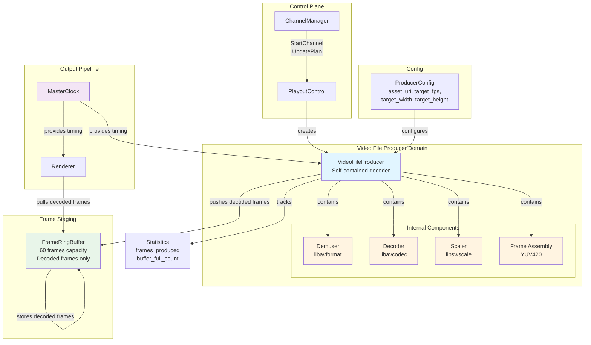

_Related: [Playout Engine Domain](PlayoutEngineDomain.md) • [Renderer Domain](RendererDomain.md) • [Architecture Overview](../architecture/ArchitectureOverview.md) • [Playout Engine Contract](../contracts/PlayoutEngineContract.md)_

# Domain — Video File Producer

Status: Enforced

## 1. Overview

The **Video File Producer** is a self-contained component in the RetroVue Air playout pipeline responsible for reading local video files, decoding them into raw YUV420 frames, and staging those decoded frames in a `FrameRingBuffer` for consumption by the Renderer.

### Purpose

The Video File Producer exists to:

- **Read and decode video assets**: Transform encoded video files (MP4, MKV, MOV, etc.) into raw YUV420 frames in a single, integrated operation
- **Maintain decode pacing**: Produce frames at the correct rate to keep the Renderer fed without buffer overflow
- **Handle backpressure**: Back off when the downstream buffer is full, preventing memory exhaustion
- **Provide timing metadata**: Attach PTS/DTS timestamps and duration information to each decoded frame
- **Support graceful lifecycle**: Start, stop, and teardown operations that coordinate with the broader channel lifecycle

### Position in Pipeline

```
┌──────────────┐     ┌──────────────────────────────┐     ┌──────────────┐     ┌──────────────┐
│   Video      │     │  VideoFile                    │     │    Frame     │     │   Renderer   │
│   File       │────▶│  Producer                     │────▶│  RingBuffer  │────▶│  (Consumer) │
│  (MP4/MKV)   │     │  (Reads + Decodes internally) │     │  (60 frames) │     │              │
└──────────────┘     └──────────────────────────────┘     └──────────────┘     └──────────────┘
     Source              Decode Stage (self-contained)         Staging              Output
```

The Video File Producer is a **standalone, self-contained decoder** that sits between the source media asset and the frame staging buffer. It performs both file reading and frame decoding internally, outputting only decoded frames ready for rendering. It does not interact directly with the Renderer; frames flow through the buffer.

### Why It Exists

- **Unified responsibility**: Reading and decoding are tightly coupled operations that belong together in a single component
- **Clean module boundary**: Producer has a simple contract: input is asset URI, output is decoded Frame objects
- **Thread safety**: Dedicated decode thread prevents blocking the control plane or renderer
- **Reusability**: The same producer pattern will support future input types (CCTV, PrevueGuide, LowerThird) that generate already-decoded frames
- **Testability**: Stub mode enables testing without real video files or FFmpeg dependencies

---

## 1.1. Goals and Non-Goals

### Goals

- **Reliable decode**: Decode video files consistently without frame drops or corruption
- **Predictable performance**: Maintain decode rate at target FPS with bounded latency
- **Graceful degradation**: Handle errors (corrupt files, missing codecs) without crashing
- **Backpressure awareness**: Respect buffer capacity limits and back off when full
- **Lifecycle management**: Support clean start, stop, and teardown operations
- **Self-contained operation**: Perform both reading and decoding internally without external decode stages

### Non-Goals

- **Content scheduling**: Does not decide what to play or when (ChannelManager responsibility)
- **Rendering/encoding**: Does not display frames or generate output streams (Renderer responsibility)
- **Network streaming**: Does not handle RTMP, SRT, or HTTP streaming (future: NetworkInputProducer)
- **Graphics generation**: Does not create lower thirds, bugs, or overlays (future: LowerThirdProducer)
- **Multi-asset playlists**: Does not manage playlists or transitions (ChannelManager orchestrates via UpdatePlan)
- **Audio processing**: Does not decode or process audio tracks (audio is Renderer responsibility)
- **Subtitle rendering**: Does not decode or render subtitles/captions (Renderer responsibility)
- **Real-time streaming**: Does not handle live camera feeds (future: CCTVInputProducer)
- **Output encoded packets**: Does not output encoded packets or require downstream decoding (outputs only decoded frames)

---

## 2. Domain Responsibilities

### What VideoFileProducer DOES

- ✅ **Read video files**: Opens and reads encoded video files (MP4, MKV, MOV, etc.) from local storage
- ✅ **Decode frames internally**: Uses FFmpeg (libavformat/libavcodec) internally to decode H.264, HEVC, and other supported codecs into raw YUV420 frames
- ✅ **Produce decoded frames at target FPS**: Maintains decode rate aligned with `target_fps` configuration (default: 30.0)
- ✅ **Push decoded frames to FrameRingBuffer**: Non-blocking push operations that respect buffer capacity
- ✅ **Attach timing metadata**: Sets PTS, DTS, duration, and asset_uri on each decoded frame
- ✅ **Handle backpressure**: Backs off (10ms) when buffer is full, allowing consumer to catch up
- ✅ **Respect MasterClock pacing**: In stub mode, aligns frame production with MasterClock deadlines
- ✅ **Track statistics**: Counts frames produced, buffer full events, and decode errors
- ✅ **Support graceful teardown**: Drains buffer on request with bounded timeout
- ✅ **Fallback to stub mode**: Automatically falls back to synthetic decoded frames if internal decoder fails to initialize
- ✅ **Scale frames**: Converts decoded frames to target resolution (default: 1920x1080)

### What VideoFileProducer DOES NOT

- ❌ **Schedule content**: Does not decide which video file to play or when (ChannelManager responsibility)
- ❌ **Render frames**: Does not display, encode, or output frames (Renderer responsibility)
- ❌ **Manage channel state**: Does not track channel lifecycle or emit state transitions (PlayoutControl responsibility)
- ❌ **Parse playout plans**: Does not interpret plan handles or resolve asset URIs (ChannelManager responsibility)
- ❌ **Handle network streams**: Does not decode RTMP, SRT, or other network protocols (future: NetworkInputProducer)
- ❌ **Generate graphics**: Does not create lower thirds, bugs, or overlays (future: LowerThirdProducer)
- ❌ **Manage multiple assets**: Does not handle playlists or transitions (ChannelManager orchestrates via UpdatePlan)
- ❌ **Emit telemetry**: Does not publish metrics directly (MetricsExporter aggregates from multiple sources)
- ❌ **Output encoded packets**: Does not output encoded packets or require downstream decoding (only outputs decoded frames)

### Boundary Conditions

The Video File Producer operates within these boundaries:

- **Input**: Single video file URI (file path or local URI)
- **Output**: Decoded Frame objects (YUV420 format) pushed to `FrameRingBuffer`
- **Threading**: One dedicated decode thread per producer instance
- **Lifecycle**: Managed by ChannelWorker (created on StartChannel, destroyed on StopChannel)
- **Configuration**: Static configuration provided at construction time (no runtime reconfiguration)

---

## 3. Architecture Diagram



### Key Relationships

1. **VideoFileProducer → Internal Decoder Components** (contains)
   - Producer encapsulates demuxer, decoder, scaler, and frame assembly
   - All FFmpeg operations are internal implementation details
   - Producer exposes only decoded Frame objects to external components

2. **VideoFileProducer → FrameRingBuffer** (pushes decoded frames)
   - Producer holds reference to buffer (owned by ChannelWorker)
   - Non-blocking push operations with decoded frames only
   - Producer backs off when buffer is full

3. **VideoFileProducer → MasterClock** (optional timing reference)
   - Used in stub mode for pacing
   - Real decode mode uses file timestamps (PTS) instead
   - Enables deterministic frame production

4. **ChannelManager → VideoFileProducer** (lifecycle control)
   - Creates producer via `StartChannel` gRPC call
   - Updates content via `UpdatePlan` (hot-swaps producer)
   - Destroys producer via `StopChannel`

---

## 4. Data Flow

### Step-by-Step Frame Production

#### Phase 1: Initialization

1. **ChannelManager** calls `StartChannel(channel_id, plan_handle, port)`
2. **PlayoutControl** creates `ChannelWorker` and allocates `FrameRingBuffer` (60 frames)
3. **PlayoutControl** constructs `ProducerConfig`:
   ```cpp
   ProducerConfig config;
   config.asset_uri = plan_handle;  // Resolved to file path
   config.target_width = 1920;
   config.target_height = 1080;
   config.target_fps = 30.0;
   config.stub_mode = false;
   ```
4. **PlayoutControl** creates `VideoFileProducer(config, ring_buffer, master_clock)`
5. **VideoFileProducer** initializes internal decoder subsystem:
   - Opens file using libavformat (demuxer)
   - Detects format and initializes codec context (decoder)
   - Configures scaler for target resolution (1920x1080)
   - Prepares frame assembly pipeline (YUV420 output)

#### Phase 2: Decode Loop (Producer Thread)

```
┌─────────────────────────────────────────────────────────────┐
│  Producer Thread (ProduceLoop)                               │
│                                                              │
│  1. Check stop_requested flag                                │
│     ↓                                                         │
│  2. If teardown requested:                                    │
│     - Wait for buffer to drain                               │
│     - Exit on timeout or empty buffer                        │
│     ↓                                                         │
│  3. Internal Decoder Subsystem:                              │
│     a. Demuxer reads AVPacket from file                     │
│     b. Decoder decodes AVPacket to AVFrame                   │
│     c. Scaler converts AVFrame to target resolution          │
│     d. Frame assembly converts to YUV420 planar format      │
│     e. Extract PTS/DTS from packet metadata                 │
│     ↓                                                         │
│  4. Wrap decoded frame in Frame object:                      │
│     - Sets frame.data (YUV420 bytes)                        │
│     - Sets frame.width, frame.height                        │
│     - Sets frame.metadata.pts, dts, duration                │
│     - Sets frame.metadata.asset_uri                          │
│     ↓                                                         │
│  5. Attempt FrameRingBuffer->Push(decoded_frame)           │
│     ↓                                                         │
│  6. If push succeeds:                                        │
│     - Increment frames_produced counter                     │
│     - Continue to next iteration                             │
│     ↓                                                         │
│  7. If push fails (buffer full):                            │
│     - Increment buffer_full_count                           │
│     - Back off 10ms (kProducerBackoffUs)                    │
│     - Retry on next iteration                               │
│     ↓                                                         │
│  8. If decoder reports EOF:                                │
│     - Set stop_requested flag                               │
│     - Exit loop                                             │
└─────────────────────────────────────────────────────────────┘
```

#### Phase 3: Frame Consumption (Renderer Thread)

The Renderer runs in a separate thread and pulls decoded frames from the same `FrameRingBuffer`:

1. **Renderer** calls `FrameRingBuffer->Pop(frame)`
2. **FrameRingBuffer** atomically copies decoded frame from buffer to renderer
3. **Renderer** processes decoded frame (display, encode, or validate)
4. **Frame memory** is released after renderer consumes it

### Frame Structure

Each decoded frame produced by VideoFileProducer has this structure:

```cpp
struct Frame {
    FrameMetadata metadata;
    std::vector<uint8_t> data;  // YUV420 planar format (decoded)
    int width;                  // e.g., 1920
    int height;                 // e.g., 1080
};

struct FrameMetadata {
    int64_t pts;                // Presentation timestamp (microseconds)
    int64_t dts;                // Decode timestamp (microseconds)
    double duration;             // Frame duration (seconds, e.g., 0.0333 for 30fps)
    std::string asset_uri;       // Source file path or URI
};
```

**YUV420 Format** (decoded frame data):
- Y plane: `width × height` bytes (luminance)
- U plane: `(width/2) × (height/2)` bytes (chrominance)
- V plane: `(width/2) × (height/2)` bytes (chrominance)
- Total size: `width × height × 1.5` bytes

**Example** (1920×1080 decoded frame):
- Y plane: 2,073,600 bytes
- U plane: 518,400 bytes
- V plane: 518,400 bytes
- Total: 3,110,400 bytes (~2.97 MB per decoded frame)

---

## 4.1. Internal Decoder Subsystem Architecture

The VideoFileProducer contains a complete FFmpeg-based decoder subsystem that performs all decoding operations internally. This subsystem consists of four main components:

### Demuxer (libavformat)

**Purpose**: Reads encoded packets from the video file container.

**Operations**:
- Opens the video file using `avformat_open_input()`
- Detects container format (MP4, MKV, MOV, etc.)
- Finds the video stream within the container
- Reads `AVPacket` objects containing encoded video data
- Extracts stream metadata (time base, codec parameters, duration)

**Key Structures**:
- `AVFormatContext`: Container format context
- `AVStream`: Video stream information
- `AVPacket`: Encoded packet data

**Thread Safety**: All demuxer operations run in the producer thread only.

### Decoder (libavcodec)

**Purpose**: Decodes encoded packets into raw video frames.

**Operations**:
- Initializes codec context based on stream codec parameters
- Supports H.264, HEVC, VP9, and other FFmpeg-supported codecs
- Sends `AVPacket` to decoder via `avcodec_send_packet()`
- Receives decoded `AVFrame` via `avcodec_receive_frame()`
- Handles codec-specific features (B-frames, frame reordering)

**Key Structures**:
- `AVCodecContext`: Codec configuration and state
- `AVCodec`: Codec implementation
- `AVFrame`: Decoded frame data (may be in various pixel formats)

**Error Handling**: Transient decode errors are logged and retried; fatal errors trigger fallback to stub mode.

### Scaler (libswscale)

**Purpose**: Converts decoded frames to target resolution and pixel format.

**Operations**:
- Creates scaling context for source → target resolution conversion
- Converts pixel format to YUV420P (planar YUV420)
- Scales frame to `target_width × target_height` (default: 1920×1080)
- Uses bilinear scaling algorithm for quality/performance balance

**Key Structures**:
- `SwsContext`: Scaling context
- `AVFrame`: Source and destination frames

**Output Format**: Always YUV420P (planar), ready for frame assembly.

### Frame Assembly

**Purpose**: Packages scaled frames into `Frame` objects with metadata.

**Operations**:
- Copies Y, U, V planes from `AVFrame` to `Frame.data` vector
- Calculates PTS/DTS in microseconds from stream time base
- Enforces PTS monotonicity (ensures `pts[i+1] > pts[i]`)
- Sets frame dimensions, duration, and asset URI
- Validates frame data size matches YUV420 format requirements

**Memory Layout** (YUV420 planar):
```
Frame.data = [Y plane] [U plane] [V plane]
             └─ width×height ─┘ └─ width/2×height/2 ─┘ └─ width/2×height/2 ─┘
```

**Invariants**:
- `frame.data.size() == width × height × 1.5`
- `frame.metadata.pts` is monotonically increasing
- `frame.metadata.dts <= frame.metadata.pts`

---

## 4.2. Frame Buffer Interaction

The `FrameRingBuffer` is a lock-free circular buffer that stages decoded frames between the producer (decode thread) and renderer (render thread).

### Buffer Architecture

**Design**:
- Fixed capacity: 60 frames (default, configurable)
- Lock-free: Uses atomic read/write indices
- Single producer, single consumer: Thread-safe for this pattern
- Non-blocking: `Push()` and `Pop()` return immediately with success/failure

**Memory Layout**:
```
FrameRingBuffer (capacity = 60)
┌─────────────────────────────────────────┐
│ [0] [1] [2] ... [58] [59]               │  ← Frame slots
│  ↑                    ↑                 │
│ read_index         write_index          │  ← Atomic indices
└─────────────────────────────────────────┘
```

### Producer → Buffer Interaction

**Push Operation** (`FrameRingBuffer::Push()`):
1. Producer thread calls `Push(decoded_frame)`
2. Buffer checks if space available: `(write_index + 1) % capacity != read_index`
3. If full: Returns `false` immediately (non-blocking)
4. If space available:
   - Copies `Frame` object into buffer slot at `write_index`
   - Atomically updates `write_index` (release memory order)
   - Returns `true`

**Backpressure Handling**:
- When `Push()` returns `false` (buffer full):
  - Producer increments `buffer_full_count_` statistic
  - Producer backs off for 10ms (`kProducerBackoffUs`)
  - Producer retries push on next decode loop iteration
  - Producer never blocks waiting for buffer space

**Frame Ownership**:
- Producer owns frame until `Push()` succeeds
- After successful push, buffer owns the frame
- Frame memory is released when renderer pops it

### Buffer → Renderer Interaction

**Pop Operation** (`FrameRingBuffer::Pop()`):
1. Renderer thread calls `Pop(frame)`
2. Buffer checks if data available: `read_index != write_index`
3. If empty: Returns `false` immediately (non-blocking)
4. If data available:
   - Copies `Frame` object from buffer slot at `read_index` to renderer
   - Atomically updates `read_index` (release memory order)
   - Returns `true`

**Buffer Depth Management**:
- **Target depth**: 30-45 frames (1-1.5 seconds at 30fps)
- **Minimum depth**: 10 frames (triggers buffering state)
- **Maximum depth**: 60 frames (triggers backpressure)

---

## 4.3. Decode Loop Mechanics

The decode loop runs in a dedicated producer thread and orchestrates the entire frame production pipeline.

### Loop Structure

```cpp
void VideoFileProducer::ProduceLoop() {
    // Initialize decoder if not in stub mode
    if (!config_.stub_mode) {
        InitializeDecoder();  // Sets up demuxer, decoder, scaler
    }
    
    // Main decode loop
    while (!stop_requested_) {
        // Check teardown conditions
        if (teardown_requested_ && buffer_.IsEmpty()) {
            break;  // Graceful shutdown
        }
        
        // Produce frame (stub or real decode)
        if (config_.stub_mode) {
            ProduceStubFrame();
        } else {
            ProduceRealFrame();  // Full decode pipeline
        }
    }
}
```

### Real Decode Path (`ProduceRealFrame()`)

**Step-by-Step Execution**:

1. **Read Packet** (`ReadPacket()`):
   ```cpp
   int ret = av_read_frame(format_ctx_, packet_);
   if (ret == AVERROR_EOF) {
       eof_reached_ = true;
       return false;
   }
   ```
   - Reads next encoded packet from file
   - Filters for video stream packets only
   - Handles EOF condition

2. **Decode Packet** (`DecodePacket()`):
   ```cpp
   avcodec_send_packet(codec_ctx_, packet_);
   avcodec_receive_frame(codec_ctx_, frame_);
   ```
   - Sends packet to decoder
   - Receives decoded frame (may require multiple packets for some codecs)
   - Handles decode errors gracefully

3. **Scale Frame** (`ScaleFrame()`):
   ```cpp
   sws_scale(sws_ctx_, 
             frame_->data, frame_->linesize, 0, codec_ctx_->height,
             scaled_frame_->data, scaled_frame_->linesize);
   ```
   - Converts pixel format to YUV420P
   - Scales to target resolution
   - Outputs to `scaled_frame_`

4. **Assemble Frame** (`AssembleFrame()`):
   ```cpp
   // Copy Y, U, V planes to Frame.data
   // Calculate PTS/DTS in microseconds
   // Set metadata
   ```
   - Copies planar data to `Frame` object
   - Converts timestamps to microseconds
   - Enforces PTS monotonicity

5. **Push to Buffer**:
   ```cpp
   if (output_buffer_.Push(frame)) {
       frames_produced_++;
   } else {
       buffer_full_count_++;
       // Back off 10ms
   }
   ```
   - Attempts non-blocking push
   - Handles backpressure with backoff
   - Tracks statistics

### Stub Mode Path (`ProduceStubFrame()`)

**Purpose**: Generate synthetic decoded frames for testing without FFmpeg.

**Operations**:
- Aligns frame production to MasterClock deadlines (if available)
- Generates YUV420 frames with correct buffer sizes (all zeros for now)
- Sets PTS/DTS metadata with correct spacing
- Uses same buffer push/backpressure logic as real decode

**Use Cases**:
- Testing without video files
- Testing without FFmpeg dependencies
- Fallback when decoder initialization fails

### Loop Timing

**Real Decode Mode**:
- Decodes frames as fast as possible from file
- PTS spacing reflects original file timing
- No artificial rate limiting (decoder runs at hardware speed)

**Stub Mode**:
- Generates frames at exactly `target_fps`
- Uses MasterClock for deadline alignment
- Waits between frames: `frame_interval_us = 1'000'000 / target_fps`

**Backpressure Impact**:
- When buffer is full, producer backs off 10ms
- This naturally throttles decode rate to match renderer consumption
- No explicit rate limiting needed in real decode mode

---

## 5. Interfaces and Contracts

### VideoFileProducer Public API

```cpp
class VideoFileProducer {
public:
    // Constructs producer with configuration and output buffer.
    VideoFileProducer(
        const ProducerConfig& config,
        buffer::FrameRingBuffer& output_buffer,
        std::shared_ptr<timing::MasterClock> clock = nullptr
    );
    
    // Starts the decode thread.
    // Returns true if started successfully, false if already running.
    bool Start();
    
    // Stops the decode thread gracefully.
    // Blocks until thread exits.
    void Stop();
    
    // Initiates graceful teardown with bounded drain timeout.
    void RequestTeardown(std::chrono::milliseconds drain_timeout);
    
    // Forces immediate stop (used when teardown times out).
    void ForceStop();
    
    // Returns true if producer is currently running.
    bool IsRunning() const;
    
    // Returns total number of decoded frames produced.
    uint64_t GetFramesProduced() const;
    
    // Returns number of times buffer was full (backpressure events).
    uint64_t GetBufferFullCount() const;
};
```

**Lifecycle Contract**:
- `Start()` can only be called when not running (returns false if already running)
- `Stop()` blocks until decode thread exits (safe to call from any thread)
- `RequestTeardown()` initiates graceful shutdown; producer drains buffer before stopping
- `ForceStop()` immediately stops producer (may drop frames in buffer)
- Destructor automatically calls `Stop()` if producer is still running

### Frame Object Shape

**Required Fields** (decoded frame):
- `frame.data`: Non-empty vector<uint8_t> containing YUV420 planar data (decoded)
- `frame.width`: Positive integer matching target_width
- `frame.height`: Positive integer matching target_height
- `frame.metadata.pts`: Monotonically increasing int64_t (microseconds)
- `frame.metadata.dts`: int64_t ≤ pts (microseconds)
- `frame.metadata.duration`: Positive double (seconds)
- `frame.metadata.asset_uri`: Non-empty string identifying source file

**Invariants**:
- `frame.data.size() == width * height * 1.5` (YUV420 decoded format)
- `pts` must increase within a single asset stream
- `duration` must match `1.0 / target_fps` (approximately)
- Frame data is always decoded (never encoded packets)

### Error Events

The VideoFileProducer handles these error conditions:

1. **Internal decoder initialization failure**:
   - Logs error: `"Failed to initialize internal decoder, falling back to stub mode"`
   - Sets `config.stub_mode = true`
   - Continues with synthetic decoded frames

2. **Internal decode error** (corrupt packet, codec error):
   - Logs error: `"Internal decode errors: N"`
   - Increments `stats.decode_errors`
   - Backs off 10ms and retries
   - Does not stop producer (allows recovery)

3. **Buffer full** (backpressure):
   - Returns false from `FrameRingBuffer->Push()`
   - Increments `buffer_full_count_`
   - Backs off 10ms (`kProducerBackoffUs`)
   - Retries on next iteration

4. **End of file**:
   - Internal decoder reports EOF
   - Sets `stop_requested_` flag
   - Exits decode loop gracefully
   - Producer enters stopped state

5. **Teardown timeout**:
   - If buffer does not drain within `drain_timeout`:
   - Logs: `"Teardown timeout reached; forcing stop"`
   - Calls `ForceStop()`

### Lifecycle Events

The producer emits these lifecycle events (via logging, not callbacks):

- **Started**: `"[VideoFileProducer] Started for asset: <uri>"`
- **Stopped**: `"[VideoFileProducer] Stopped. Total decoded frames produced: <count>"`
- **Teardown requested**: `"[VideoFileProducer] Teardown requested (timeout=<ms>)"`
- **Buffer drained**: `"[VideoFileProducer] Buffer drained; completing teardown"`
- **Decode loop exited**: `"[VideoFileProducer] Decode loop exited"`

**Note**: The producer does not emit gRPC events or metrics directly. The `MetricsExporter` aggregates statistics from multiple sources.

---

## 5.1. Key Contracts Tested

The following contracts are verified by unit and integration tests in `tests/test_decode.cpp` and contract test suites:

### Lifecycle Contracts

- ✅ **Construction**: Producer initializes in stopped state with zero decoded frames produced
- ✅ **Start/Stop**: `Start()` returns false if already running; `Stop()` blocks until thread exits
- ✅ **Idempotent Stop**: `Stop()` is safe to call multiple times (before or after start)
- ✅ **Destructor**: Destructor automatically stops producer if still running (no hanging threads)

### Frame Production Contracts

- ✅ **Decoded frame metadata**: All decoded frames have valid PTS, DTS, duration, asset_uri, width, height
- ✅ **PTS monotonicity**: PTS values increase monotonically within a single asset stream
- ✅ **Decoded frame format**: Frame data is valid YUV420 planar format with correct size (`width × height × 1.5`)
- ✅ **Buffer filling**: Producer fills buffer to capacity with decoded frames when consumer is not pulling

### Backpressure Contracts

- ✅ **Buffer full handling**: Producer backs off (10ms) when buffer is full and tracks `buffer_full_count`
- ✅ **Non-blocking push**: Producer never blocks on `FrameRingBuffer->Push()` (returns false instead)
- ✅ **Recovery**: Producer resumes normal operation after buffer space becomes available

### Error Handling Contracts

- ✅ **Internal decoder fallback**: Producer falls back to stub mode if internal decoder fails to initialize
- ✅ **Internal decode errors**: Producer continues operation after transient decode errors (backs off and retries)
- ✅ **EOF handling**: Producer stops gracefully when internal decoder reports end of file

### Statistics Contracts

- ✅ **Frame counting**: `GetFramesProduced()` accurately counts successfully pushed decoded frames
- ✅ **Buffer full tracking**: `GetBufferFullCount()` increments on each buffer full event
- ✅ **Thread safety**: Statistics are updated atomically and safe to read from any thread

**Test Coverage**: See `tests/test_decode.cpp` for unit tests and `tests/contracts/` for integration contract tests.

---

## 6. Timing and Buffering Rules

### Decode Rate

The VideoFileProducer maintains decode rate based on the configured `target_fps`:

- **Real decode mode**: Internal decoder reads and decodes frames as fast as possible from file, but frame timestamps (PTS) reflect original file timing
- **Stub mode**: Producer generates decoded frames at exactly `target_fps` using MasterClock pacing

**Example** (30 fps):
- Frame interval: `1.0 / 30.0 = 0.0333 seconds = 33,333 microseconds`
- In stub mode: Producer waits 33,333 µs between decoded frames (aligned to MasterClock)
- In real decode mode: Internal decoder may decode faster than real-time, but PTS spacing is preserved

### Backpressure Handling

When `FrameRingBuffer` is full (60 decoded frames), the producer:

1. **Detects full buffer**: `Push()` returns false
2. **Backs off**: Waits `kProducerBackoffUs` (10,000 µs = 10 ms)
3. **Retries**: Attempts push again on next iteration
4. **Tracks events**: Increments `buffer_full_count_` for monitoring

**Rationale**: Backing off prevents CPU spinning and allows the Renderer thread to consume decoded frames. The 10ms backoff is a balance between responsiveness and CPU efficiency.

**MC-004 Compliance**: The backoff mechanism ensures downstream consumers have time to recover from buffer saturation.

### Timestamps

**PTS (Presentation Timestamp)**:
- Extracted from video file packet timestamps by internal decoder
- Converted to microseconds using stream time_base
- Monotonically increasing within a single asset
- Used by Renderer for frame pacing

**DTS (Decode Timestamp)**:
- Extracted from video file packet timestamps by internal decoder
- May be less than PTS for B-frames (out-of-order decode)
- Currently set equal to PTS in implementation (simplification)

**Duration**:
- Calculated as `1.0 / target_fps` (e.g., 0.0333 for 30 fps)
- May not match actual frame duration in file (variable frame rate files)

**Station Timestamp** (future):
- Virtual timeline aligned to MasterClock
- Used for multi-channel synchronization
- Not currently implemented in VideoFileProducer

### Sync with Renderer

The VideoFileProducer does not directly synchronize with the Renderer. Instead:

1. **Producer** pushes decoded frames to `FrameRingBuffer` as fast as decode allows (or at target_fps in stub mode)
2. **Renderer** pulls decoded frames from buffer at MasterClock-aligned intervals
3. **Buffer depth** naturally regulates flow:
   - If producer is faster: Buffer fills up, producer backs off
   - If renderer is faster: Buffer empties, renderer waits

**Buffer Depth Targets**:
- **Minimum**: 30 decoded frames (1 second at 30 fps) — ensures smooth playback
- **Maximum**: 60 decoded frames (2 seconds at 30 fps) — prevents excessive latency
- **Optimal**: 45 decoded frames (1.5 seconds) — balance between latency and safety margin

**OrchestrationLoop** monitors buffer depth and triggers state transitions:
- Buffer depth < 10 decoded frames: Channel enters `buffering` state
- Buffer depth > 50 decoded frames: Channel enters `ready` state

---

## 7. Interaction with Channel Manager

### Preview → Live Switching

The ChannelManager orchestrates preview-to-live switching using the `UpdatePlan` gRPC call:

**Current Implementation** (hot-swap):

1. **ChannelManager** calls `UpdatePlan(channel_id, new_plan_handle)`
2. **PlayoutControl** stops current producer:
   ```cpp
   worker->producer->Stop();
   worker->ring_buffer->Clear();
   ```
3. **PlayoutControl** creates new producer with new plan:
   ```cpp
   producer_config.asset_uri = new_plan_handle;
   worker->producer = std::make_unique<VideoFileProducer>(...);
   worker->producer->Start();
   ```
4. **Producer** begins reading and decoding new content
5. **Buffer** fills to minimum depth (30 decoded frames)
6. **Channel** transitions to `ready` state

**Future Optimization** (seamless transition):
- Producer could support `SwitchInput(new_asset_uri)` without stopping
- Buffer could maintain decoded frames from old input while new input buffers
- Renderer could blend or cut between inputs at frame boundary

### Event Emission

The VideoFileProducer does not emit gRPC events directly. Instead:

1. **Producer** logs lifecycle events (started, stopped, errors)
2. **MetricsExporter** aggregates statistics:
   - `frames_produced` → `retrovue_playout_frames_produced{channel="N"}`
   - `buffer_full_count` → `retrovue_playout_buffer_full_events{channel="N"}`
3. **PlayoutControl** emits channel state transitions:
   - `StartChannel` → channel state = `ready`
   - `UpdatePlan` → channel state = `buffering` → `ready`
   - `StopChannel` → channel state = `stopped`

**ChannelManager** monitors channel state via Prometheus metrics endpoint:
```
GET http://localhost:8080/metrics
# Returns:
retrovue_playout_channel_state{channel="1"} 2  # 2 = ready
retrovue_playout_frames_produced{channel="1"} 1500
```

### Preview Input Feeding

The ChannelManager feeds preview content to a separate preview channel:

**Architecture**:
```
┌─────────────────┐
│ ChannelManager  │
│                 │
│  Preview        │───StartChannel(channel_id=0, plan="preview.mp4")
│  Channel        │
│                 │
│  Live           │───StartChannel(channel_id=1, plan="live.mp4")
│  Channel        │
└─────────────────┘
         │
         ├───gRPC───▶ PlayoutControl
                          │
                          ├───Channel 0: VideoFileProducer("preview.mp4")
                          └───Channel 1: VideoFileProducer("live.mp4")
```

**Preview Channel**:
- Uses same `VideoFileProducer` as live channel
- Configured with `RenderMode::PREVIEW` (if SDL2 available)
- Renders to preview window instead of MPEG-TS stream
- Can be switched to live via `UpdatePlan` on live channel

**Example Flow**:
1. ChannelManager starts preview channel (channel_id=0) with `preview_content.mp4`
2. Operator reviews preview in preview window
3. Operator clicks "Take to Live"
4. ChannelManager calls `UpdatePlan(channel_id=1, plan="preview_content.mp4")`
5. Live channel switches to preview content
6. Preview channel continues showing preview (or switches to next preview)

---

## 8. Known Constraints

### Current Limitations

1. **Local files only**: 
   - Supports file:// URIs and local file paths
   - Does not support network streams (RTMP, SRT, HTTP)
   - Does not support remote storage (S3, GCS) — must be mounted locally

2. **Single asset per producer**:
   - One producer reads and decodes one video file
   - No playlist support within producer
   - ChannelManager must call `UpdatePlan` to switch assets

3. **Fixed resolution**:
   - All decoded frames scaled to `target_width × target_height` (1920×1080 default)
   - No dynamic resolution changes during decode
   - Aspect ratio may be distorted if source aspect ratio differs

4. **YUV420 only**:
   - Output format is always YUV420 planar (decoded)
   - No RGB, YUV422, or other formats
   - Renderer must handle YUV420 (or convert)

5. **No audio**:
   - Video-only decode (audio streams are ignored)
   - Audio handling is Renderer responsibility (if needed)

6. **No subtitle/caption support**:
   - Subtitle tracks are ignored
   - Caption rendering is Renderer responsibility

7. **Hot-swap limitation**:
   - `UpdatePlan` stops and restarts producer (brief interruption)
   - No seamless transition between assets
   - Buffer is cleared on plan update

8. **Error recovery**:
   - Internal decode errors cause backoff and retry (may skip frames)
   - No automatic retry of entire file on fatal errors
   - Channel enters `error` state on persistent failures

### Assumptions

1. **File accessibility**: Video files are readable by the playout engine process
2. **Codec support**: Files use codecs supported by FFmpeg (H.264, HEVC, VP9, etc.)
3. **Frame rate**: Files have consistent frame rate (variable frame rate files may cause timing issues)
4. **Memory**: System has sufficient RAM for buffer (60 decoded frames × ~3 MB = ~180 MB per channel)
5. **CPU**: Internal decoder thread can keep up with target_fps (hardware acceleration recommended for 4K)

---

## 8.1. Anti-patterns / What NOT to Do

### ❌ Do NOT Block on Buffer Push

**Anti-pattern**:
```cpp
// WRONG: Blocking push will deadlock if buffer is full
while (!buffer.Push(frame)) {
    // Infinite loop - producer thread hangs
}
```

**Correct pattern**:
```cpp
// CORRECT: Non-blocking push with backoff
if (!buffer.Push(frame)) {
    buffer_full_count_++;
    WaitForMicros(master_clock_, kProducerBackoffUs);  // Back off 10ms
    // Retry on next iteration
}
```

**Why**: The producer thread must never block waiting for buffer space. Backpressure is handled by backing off and allowing the consumer (Renderer) to catch up.

### ❌ Do NOT Access FFmpeg APIs Directly from External Components

**Anti-pattern**:
```cpp
// WRONG: External component directly uses FFmpeg
AVFormatContext* format_ctx = avformat_open_input(...);
// External component is tightly coupled to FFmpeg
```

**Correct pattern**:
```cpp
// CORRECT: FFmpeg is internal to VideoFileProducer
// External components only interact with VideoFileProducer API
auto producer = std::make_unique<VideoFileProducer>(config, buffer);
// FFmpeg operations are encapsulated inside producer
```

**Why**: FFmpeg operations are internal implementation details of VideoFileProducer. External components should only interact with the producer's public API and receive decoded frames.

### ❌ Do NOT Emit Metrics or gRPC Events

**Anti-pattern**:
```cpp
// WRONG: Producer directly emits metrics
metrics_exporter_->SubmitChannelMetrics(channel_id, metrics);
// Producer is coupled to telemetry system
```

**Correct pattern**:
```cpp
// CORRECT: Producer only tracks internal statistics
frames_produced_++;
buffer_full_count_++;
// MetricsExporter reads statistics via GetFramesProduced()
```

**Why**: The producer should be a pure decode component. Telemetry aggregation is handled by `MetricsExporter`, which reads producer statistics via public getters.

### ❌ Do NOT Parse Playout Plans

**Anti-pattern**:
```cpp
// WRONG: Producer interprets plan handles
Plan plan = ParsePlanHandle(plan_handle);
std::string asset_uri = plan.GetFirstAsset();
// Producer is coupled to plan format
```

**Correct pattern**:
```cpp
// CORRECT: Producer receives resolved asset URI
ProducerConfig config;
config.asset_uri = plan_handle;  // Already resolved by ChannelManager
// Producer treats asset_uri as opaque string
```

**Why**: The producer should not know about playout plans or scheduling logic. The ChannelManager resolves plan handles to asset URIs before creating the producer.

### ❌ Do NOT Manage Channel State

**Anti-pattern**:
```cpp
// WRONG: Producer transitions channel state
if (buffer.Size() < 10) {
    channel_state_ = ChannelState::BUFFERING;
    EmitStateTransition(channel_id, channel_state_);
}
// Producer is coupled to channel lifecycle
```

**Correct pattern**:
```cpp
// CORRECT: Producer only tracks internal state
bool is_running_ = true;
// OrchestrationLoop monitors buffer depth and transitions channel state
```

**Why**: Channel state management is the responsibility of `PlayoutControl` and `OrchestrationLoop`. The producer only tracks whether it is running or stopped.

### ❌ Do NOT Use Blocking I/O in Decode Thread

**Anti-pattern**:
```cpp
// WRONG: Blocking file I/O in decode thread
std::ifstream file(asset_uri);
file.read(buffer, size);  // Blocks if file is on slow network mount
// Decode thread hangs, frames stop flowing
```

**Correct pattern**:
```cpp
// CORRECT: Internal decoder handles I/O with buffering
// Decoder reads ahead in background, decode thread never blocks
// This is handled internally by VideoFileProducer's decoder subsystem
```

**Why**: The decode thread must maintain real-time frame production. Blocking I/O operations will cause frame drops and buffer underruns.

### ❌ Do NOT Skip Backpressure Handling

**Anti-pattern**:
```cpp
// WRONG: Ignore buffer full condition
buffer.Push(frame);  // Returns false, but we ignore it
frames_produced_++;  // Count frame even though it wasn't pushed
// Decoded frames are silently dropped, statistics are wrong
```

**Correct pattern**:
```cpp
// CORRECT: Handle backpressure explicitly
if (output_buffer_.Push(frame)) {
    frames_produced_.fetch_add(1);
} else {
    buffer_full_count_.fetch_add(1);
    WaitForMicros(master_clock_, kProducerBackoffUs);
}
```

**Why**: Ignoring backpressure leads to memory exhaustion (buffer overflows), incorrect statistics, and potential crashes. The producer must respect buffer capacity limits.

### ❌ Do NOT Start Producer Multiple Times

**Anti-pattern**:
```cpp
// WRONG: Start producer without checking state
producer.Start();  // First call
producer.Start();  // Second call - creates duplicate thread!
// Two decode threads compete for same buffer
```

**Correct pattern**:
```cpp
// CORRECT: Check state before starting
if (!producer.IsRunning()) {
    producer.Start();
}
// Or use the return value
if (!producer.Start()) {
    // Already running, handle error
}
```

**Why**: Starting a producer multiple times creates duplicate decode threads that compete for the same buffer, causing race conditions and frame corruption.

### ❌ Do NOT Modify Configuration After Construction

**Anti-pattern**:
```cpp
// WRONG: Change config while producer is running
producer.config_.target_fps = 60.0;  // Producer already started!
// Producer behavior changes mid-operation, causing timing issues
```

**Correct pattern**:
```cpp
// CORRECT: Configuration is immutable after construction
ProducerConfig config;
config.target_fps = 60.0;
auto producer = std::make_unique<VideoFileProducer>(config, buffer);
// Config is frozen at construction time
```

**Why**: Configuration changes during operation cause unpredictable behavior (frame rate changes, resolution mismatches). To change configuration, stop the producer, create a new one with new config, and start it.

### ❌ Do NOT Access Buffer from Multiple Threads

**Anti-pattern**:
```cpp
// WRONG: Multiple threads push to same buffer
std::thread producer1([&]() { buffer.Push(frame1); });
std::thread producer2([&]() { buffer.Push(frame2); });
// FrameRingBuffer is single-producer, causes race conditions
```

**Correct pattern**:
```cpp
// CORRECT: One producer thread per buffer
// Producer thread: pushes decoded frames
// Renderer thread: pops decoded frames
// No other threads access buffer
```

**Why**: `FrameRingBuffer` is designed for single-producer, single-consumer use. Multiple producers cause race conditions and frame corruption.

### ❌ Do NOT Output Encoded Packets

**Anti-pattern**:
```cpp
// WRONG: Producer outputs encoded packets
AVPacket packet;
// ... encode packet ...
buffer.Push(packet);  // Renderer must decode!
// This violates the architectural rule
```

**Correct pattern**:
```cpp
// CORRECT: Producer outputs only decoded frames
Frame frame;
frame.data = decoded_yuv420_data;  // Already decoded
buffer.Push(frame);  // Renderer receives decoded frame
```

**Why**: The architectural rule is clear: Producers output decoded frames, not encoded packets. Decoding is the responsibility of the Producer, not the Renderer.

---

## 9. Future Extensions

Future producers (PrevueChannelProducer, CCTVProducer, etc.) will follow the same pattern: they generate already-decoded frames and push them to FrameRingBuffer. This reinforces why decoding belongs inside each Producer, not at a central layer.

### CCTVInputProducer

**Purpose**: Generate decoded frames from CCTV camera streams (RTSP, ONVIF)

**Implementation**:
```cpp
class CCTVProducer {
    // Connects to RTSP stream
    // Decodes H.264 stream from camera internally
    // Generates decoded frames at camera's native frame rate
    // Pushes decoded frames to FrameRingBuffer
};
```

**Key Point**: CCTVProducer will also perform decoding internally (just like VideoFileProducer), outputting decoded frames ready for the renderer.

### PrevueGuideProducer

**Purpose**: Generate decoded frames from PrevueGuide schedule data (text, graphics, animations)

**Implementation**:
```cpp
class PrevueGuideProducer {
    // Reads PrevueGuide schedule JSON
    // Renders text/graphics to frame buffer (already decoded)
    // Animates transitions between shows
    // Pushes decoded frames to FrameRingBuffer
};
```

**Key Point**: PrevueGuideProducer generates frames that are already in decoded format (no encoding step), so it naturally fits the Producer pattern.

### LowerThirdProducer

**Purpose**: Generate decoded lower third graphics overlays (name tags, tickers, bugs)

**Implementation**:
```cpp
class LowerThirdProducer {
    // Reads lower third data (name, title, etc.)
    // Renders graphics with transparency (alpha channel) - already decoded
    // Supports animation (slide-in, fade)
    // Pushes decoded frames to FrameRingBuffer
};
```

**Key Point**: LowerThirdProducer generates frames that are already decoded (rendered graphics), so it also fits the Producer pattern.

### Common Pattern

All future producers will:

1. **Output decoded frames**: All frames pushed to FrameRingBuffer are decoded (ready for renderer)
2. **Self-contained operation**: Each producer handles its own input reading and decoding internally
3. **Use same FrameRingBuffer**: Compatible with existing Renderer
4. **Respect same timing contract**: PTS, DTS, duration metadata
5. **Support same lifecycle**: Start, Stop, RequestTeardown methods

**Architectural Consistency**: This unified model ensures that:
- VideoFileProducer decodes video files internally
- CCTVProducer decodes camera streams internally
- PrevueGuideProducer generates decoded graphics frames
- LowerThirdProducer generates decoded overlay frames
- All producers output decoded frames to FrameRingBuffer
- Renderer only consumes decoded frames (never decodes)

---

## 10. Glossary

**Frame**  
A single decoded video frame containing raw pixel data (YUV420 format) and timing metadata (PTS, DTS, duration). Frames are the atomic unit of data flowing through the playout pipeline. All frames in FrameRingBuffer are decoded and ready for rendering.

**Producer**  
A component that generates decoded frames and pushes them into a `FrameRingBuffer`. The VideoFileProducer is a specialization that reads video files and decodes them internally. Future producers (CCTV, PrevueGuide) will also output decoded frames, either by decoding streams or generating graphics.

**Pipeline**  
The end-to-end data flow from source (video file) through decode (VideoFileProducer's internal decoder) and staging (FrameRingBuffer) to output (Renderer). The pipeline ensures decoded frames flow at the correct rate with proper timing.

**Renderer**  
The consumer component that pulls decoded frames from the `FrameRingBuffer` and delivers them to output targets (display, MPEG-TS stream, validation). The Renderer runs in a separate thread and maintains its own pacing. The Renderer never decodes frames; it only consumes already-decoded frames.

**Playout**  
The overall process of decoding scheduled content and delivering it as a broadcast stream. The RetroVue Air playout engine orchestrates multiple channels, each with its own producer, buffer, and renderer.

**FrameRingBuffer**  
A lock-free circular buffer that stages decoded frames between the producer (decode thread) and renderer (render thread). Default capacity is 60 frames (2 seconds at 30 fps). Contains only decoded frames, never encoded packets.

**MasterClock**  
The authoritative timing source from RetroVue Core that ensures all channels remain synchronized. The VideoFileProducer uses MasterClock for pacing in stub mode and for timestamp alignment.

**PTS (Presentation Timestamp)**  
The timestamp indicating when a frame should be displayed. Extracted from video file packet timestamps by the internal decoder and converted to microseconds. Must be monotonically increasing within a single asset.

**DTS (Decode Timestamp)**  
The timestamp indicating when a frame should be decoded. May be less than PTS for B-frames (out-of-order decode). Currently set equal to PTS in the implementation.

**Backpressure**  
The condition when the downstream buffer is full and the producer cannot push more decoded frames. The VideoFileProducer handles backpressure by backing off (waiting 10ms) and retrying.

**Teardown**  
A graceful shutdown procedure where the producer stops generating new decoded frames and waits for the buffer to drain before exiting. Used during channel transitions to avoid dropping frames.

**Internal Decoder Subsystem**  
The FFmpeg-based components (demuxer, decoder, scaler) that are encapsulated inside VideoFileProducer. These are implementation details; external components only see decoded Frame objects.

---

## See Also

- [Playout Engine Domain](PlayoutEngineDomain.md) — Overall channel architecture
- [Renderer Domain](RendererDomain.md) — Frame consumption and output
- [Architecture Overview](../architecture/ArchitectureOverview.md) — System-wide architecture
- [Playout Engine Contract](../contracts/PlayoutEngineContract.md) — Behavioral guarantees
- [GLOSSARY.md](../GLOSSARY.md) — Additional terminology

---

## Design Change Notes (2025 Revision)

### Architectural Clarification

This document has been updated to reflect a clarified architectural decision:

**Core Rule**: A Producer in RetroVue outputs *decoded frames*, ready for the renderer. A Producer does *not* output encoded packets. Any decoding required is done inside the concrete Producer.

### Changes Made

1. **Unified Producer Model**: VideoFileProducer now performs both reading and decoding internally. There is no separate FFmpegDecoder stage in the pipeline. Instead, VideoFileProducer *contains* the FFmpeg-based decoder internally.

2. **Decoded Frames Only**: FrameRingBuffer now explicitly contains only decoded frames. All references to encoded packets or downstream decoding have been removed.

3. **Simplified Pipeline**: The pipeline is now simpler and more object-oriented:
   - Input: asset URI
   - VideoFileProducer: reads file + decodes internally → outputs decoded frames
   - FrameRingBuffer: stores decoded frames
   - Renderer: consumes decoded frames (never decodes)

4. **Future Producers**: Future producers (PrevueChannelProducer, CCTVProducer, etc.) will NOT need decoding — they will simply generate already-decoded frames. This reinforces why decoding belongs inside each Producer, not at a central layer.

5. **Internal Components**: The document now clarifies the internal components of VideoFileProducer:
   - Demuxer (libavformat)
   - Decoder (libavcodec)
   - Optional scaler (libswscale)
   - Frame assembly into YUV420
   - PTS/DTS assignment
   - Pushing decoded frames into FrameRingBuffer

### Benefits

- **Cleaner Architecture**: Clear separation of concerns with Producers handling all decoding internally
- **Simplified Pipeline**: No separate decode stage simplifies the system
- **Consistent Pattern**: All producers follow the same pattern (output decoded frames)
- **Better Encapsulation**: FFmpeg operations are internal implementation details
