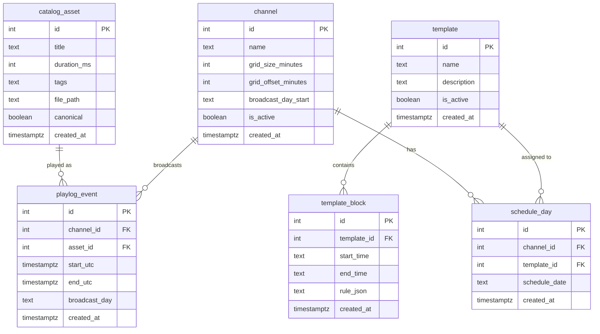

_Related: [Data model README](README.md) • [Infrastructure bootstrap](../infra/bootstrap.md) • [Architecture overview](../architecture/ArchitectureOverview.md)_

# RetroVue Broadcast Data Model

> This document describes the Broadcast Domain tables that control channel policy, scheduling, and playout.
> These tables are managed through operator tools and are consumed by ScheduleService and runtime playout.
> They are separate from Library Domain tables (episodes, assets, provider_refs, review_queue, seasons, titles, etc.).

These tables live in Postgres and are created by Alembic migrations. Runtime code is forbidden from altering core configuration tables.

**Critical Rule**: The tables `channels`, `templates`, `template_blocks`, `schedule_days`, and `playlog_events` have been removed. They were replaced by the Broadcast Domain tables and must not be reintroduced.

## Conventions

- **timestamptz columns** are station audit timestamps, default NOW() on write.
- **"broadcast day"** refers to the 06:00 → 06:00 programming day (programming_day_start).
- **"canonical"** means "approved for air".

## Tables

### channel

Defines channel timing policy and operational parameters. Each channel represents a broadcast stream with its own schedule and grid configuration.

| Column              | Type        | Description                                                                  | Required? | Who writes it                       | Who reads it                                             |
| ------------------- | ----------- | ---------------------------------------------------------------------------- | --------- | ----------------------------------- | -------------------------------------------------------- |
| id                  | INTEGER     | Primary key                                                                  | Yes       | retrovue CLI / infra.admin_services | ScheduleService, runtime/ChannelManager, reporting       |
| name                | TEXT        | Channel name (unique)                                                        | Yes       | retrovue CLI / infra.admin_services | ScheduleService, runtime/ChannelManager, ProgramDirector |
| grid_size_minutes   | INTEGER     | Programming grid size in minutes                                             | Yes       | retrovue CLI / infra.admin_services | ScheduleService                                          |
| grid_offset_minutes | INTEGER     | Grid offset from hour boundary                                               | Yes       | retrovue CLI / infra.admin_services | ScheduleService                                          |
| broadcast_day_start | TEXT        | Local-time anchor for broadcast day start (HH:MM, e.g. "06:00")             | Yes       | retrovue CLI / infra.admin_services | ScheduleService                                          |
| is_active           | BOOLEAN     | Channel operational status                                                   | Yes       | retrovue CLI / infra.admin_services | ScheduleService, runtime/ChannelManager                  |
| created_at          | TIMESTAMPTZ | Creation timestamp                                                           | Yes       | Database                            | Audit, reporting                                         |

### template

Programming templates that define daypart rules and content selection criteria. Templates are reusable scheduling patterns.

| Column      | Type        | Description                 | Required? | Who writes it                       | Who reads it                     |
| ----------- | ----------- | --------------------------- | --------- | ----------------------------------- | -------------------------------- |
| id          | INTEGER     | Primary key                 | Yes       | retrovue CLI / infra.admin_services | ScheduleService                  |
| name        | TEXT        | Template name (unique)      | Yes       | retrovue CLI / infra.admin_services | ScheduleService, ProgramDirector |
| description | TEXT        | Human-readable description  | No        | retrovue CLI / infra.admin_services | ProgramDirector                  |
| is_active   | BOOLEAN     | Template operational status | Yes       | retrovue CLI / infra.admin_services | ScheduleService                  |
| created_at  | TIMESTAMPTZ | Creation timestamp          | Yes       | Database                            | Audit, reporting                 |

### template_block

Time blocks within templates that define programming rules for specific time periods. Each block contains JSON rules for content selection.

| Column      | Type        | Description                                                                                 | Required? | Who writes it                       | Who reads it     |
| ----------- | ----------- | ------------------------------------------------------------------------------------------- | --------- | ----------------------------------- | ---------------- |
| id          | INTEGER     | Primary key                                                                                 | Yes       | retrovue CLI / infra.admin_services | ScheduleService  |
| template_id | INTEGER     | Foreign key to template                                                                     | Yes       | retrovue CLI / infra.admin_services | ScheduleService  |
| start_time  | TEXT        | Start time in HH:MM format (local wallclock)                                                | Yes       | retrovue CLI / infra.admin_services | ScheduleService  |
| end_time    | TEXT        | End time in HH:MM format (local wallclock)                                                  | Yes       | retrovue CLI / infra.admin_services | ScheduleService  |
| rule_json   | TEXT        | JSON rules for content selection (e.g. {"tags":["sitcom"], "episode_policy":"syndication"}) | Yes       | retrovue CLI / infra.admin_services | ScheduleService  |
| created_at  | TIMESTAMPTZ | Creation timestamp                                                                          | Yes       | Database                            | Audit, reporting |

### schedule_day

Assigns a template to a channel for a specific broadcast day. Each channel can have exactly one template per broadcast day.

| Column        | Type        | Description                                                                          | Required? | Who writes it                       | Who reads it     |
| ------------- | ----------- | ------------------------------------------------------------------------------------ | --------- | ----------------------------------- | ---------------- |
| id            | INTEGER     | Primary key                                                                          | Yes       | retrovue CLI / infra.admin_services | ScheduleService  |
| channel_id    | INTEGER     | Foreign key to channel                                                               | Yes       | retrovue CLI / infra.admin_services | ScheduleService  |
| template_id   | INTEGER     | Foreign key to template                                                              | Yes       | retrovue CLI / infra.admin_services | ScheduleService  |
| schedule_date | TEXT        | Broadcast day label in YYYY-MM-DD format (uses broadcast day rollover, not midnight) | Yes       | retrovue CLI / infra.admin_services | ScheduleService  |
| created_at    | TIMESTAMPTZ | Creation timestamp                                                                   | Yes       | Database                            | Audit, reporting |

**Constraints:**

- Unique constraint on (channel_id, schedule_date) ensures one template per channel per broadcast day

### Asset (from Library Domain)

Broadcast-approved assets that are eligible for scheduling. Assets from the Library Domain can be scheduled when `state='ready'` and `approved_for_broadcast=true`. The Asset table serves as the single source of truth for schedulable content.

| Column                 | Type        | Description                                                               | Required? | Who writes it                       | Who reads it                                             |
| ---------------------- | ----------- | ------------------------------------------------------------------------- | --------- | ----------------------------------- | -------------------------------------------------------- |
| id                     | INTEGER     | Primary key                                                               | Yes       | retrovue CLI / infra.admin_services | ScheduleService, runtime/ChannelManager                  |
| title                  | TEXT        | Asset title as it appears on-air                                          | Yes       | retrovue CLI / infra.admin_services | ScheduleService, runtime/ChannelManager, ProgramDirector |
| duration_ms            | INTEGER     | Duration in milliseconds                                                  | Yes       | retrovue CLI / infra.admin_services | ScheduleService, runtime/ChannelManager                  |
| tags                   | TEXT        | Comma-separated tags for scheduling rules (e.g. "sitcom,retro")           | No        | retrovue CLI / infra.admin_services | ScheduleService                                          |
| file_path              | TEXT        | Playable file path                                                        | Yes       | retrovue CLI / infra.admin_services | runtime/ChannelManager                                   |
| canonical              | BOOLEAN     | Approval status - only canonical=true entries are eligible for scheduling | Yes       | retrovue CLI / infra.admin_services | ScheduleService, runtime/ChannelManager                  |
| source_ingest_asset_id | INTEGER     | Link to Library Domain asset for provenance/audit                         | No        | retrovue CLI / infra.admin_services | Audit, reporting                                         |
| created_at             | TIMESTAMPTZ | Creation timestamp                                                        | Yes       | Database                            | Audit, reporting                                         |

**Indexes:**

- Index on canonical for ScheduleService filtering
- Index on tags for rule matching

> **Future integration:**  
> Path resolution from ingest (Plex) source paths to local playout paths is currently performed implicitly.  
> A `path_mapping` table will be introduced to manage library-level mappings (`root_path` → `local_path`) and enforce `file_path` validity during promotion.  
> Until this is implemented, operators must ensure that promoted assets reference locally playable files.

### playlog_event

Generated playout events that record what actually aired. This is the authoritative source of truth for as-run logs and compliance evidence.

| Column        | Type        | Description                                                                                  | Required? | Who writes it   | Who reads it                                       |
| ------------- | ----------- | -------------------------------------------------------------------------------------------- | --------- | --------------- | -------------------------------------------------- |
| id            | INTEGER     | Primary key                                                                                  | Yes       | ScheduleService | runtime/ChannelManager, ProgramDirector, reporting |
| channel_id    | INTEGER     | Foreign key to channel                                                                       | Yes       | ScheduleService | runtime/ChannelManager, ProgramDirector, reporting |
| asset_id      | INTEGER     | Foreign key to catalog_asset                                                                 | Yes       | ScheduleService | runtime/ChannelManager, ProgramDirector, reporting |
| start_utc     | TIMESTAMPTZ | Actual start time in UTC                                                                     | Yes       | ScheduleService | runtime/ChannelManager, ProgramDirector, reporting |
| end_utc       | TIMESTAMPTZ | Actual end time in UTC                                                                       | Yes       | ScheduleService | runtime/ChannelManager, ProgramDirector, reporting |
| broadcast_day | TEXT        | Broadcast day label for this event (may differ from calendar day for late-night programming) | Yes       | ScheduleService | runtime/ChannelManager, ProgramDirector, reporting |
| created_at    | TIMESTAMPTZ | Creation timestamp                                                                           | Yes       | Database        | Audit, reporting                                   |

**Indexes:**

- Index on (channel_id, start_utc) for runtime queries
- Index on broadcast_day for reporting

## Relationships

**Key Invariants:**

- Each channel has policy (grid, broadcast_day_start).
- Each broadcast day for a channel is assigned exactly one template.
- Each template is broken into time blocks with rule_json.
- rule_json selects from the broadcast catalog (catalog_asset) using tags.
- Only canonical=true catalog entries are eligible.
- playlog_event is authoritative for "what aired / is airing / will air."

## Authority and Mutability

### Configuration Tables (channel, template, template_block, schedule_day, catalog_asset)

**Authority:** retrovue CLI / infra.admin_services  
**Runtime Access:** Read-only  
**Audit Status:** Station configuration

These tables are operator-configurable and must not be modified by runtime code. They represent station policy and broadcast catalog curation. Runtime components are forbidden from altering these tables.

### Playlog Table (playlog_event)

**Authority:** ScheduleService  
**Runtime Access:** Read-only  
**Audit Status:** As-run source of truth

This table is generated by ScheduleService and consumed by runtime components. ChannelManager must never invent rows here. CLI modification is restricted to debugging and forensics only.

### Canonical Gating Rules

- **ScheduleService is forbidden** to schedule any catalog_asset where canonical=false.
- **ChannelManager is forbidden** to playout any catalog_asset where canonical=false.
- **Promotion into the broadcast catalog** is an explicit operator act via `retrovue assets promote`.

The canonical flag serves as the approval gate between Library Domain inventory and broadcast scheduling. Only explicit operator approval makes content eligible for air.

## Promotion Workflow: Library → Broadcast Catalog

The Library Domain discovers, ingests, enriches, and reviews media. Once an operator decides "this can air," they run `retrovue assets promote`. Promotion writes a new row into `catalog_asset` in the Broadcast Domain. That row includes:

- title (guide-facing)
- duration_ms (used by scheduler math)
- tags (used to satisfy template_block rule_json)
- file_path (what ChannelManager will actually playout)
- canonical (if true, it's allowed on air)
- source_ingest_asset_id (for provenance / audit)

ScheduleService queries Asset records where `state='ready'` and `approved_for_broadcast=true` to fill schedule blocks.

**Critical Rules:**

- **ScheduleService is forbidden** to schedule any Asset with `approved_for_broadcast=false`.
- **Runtime / ChannelManager is forbidden** to playout any Asset with `approved_for_broadcast=false`.
