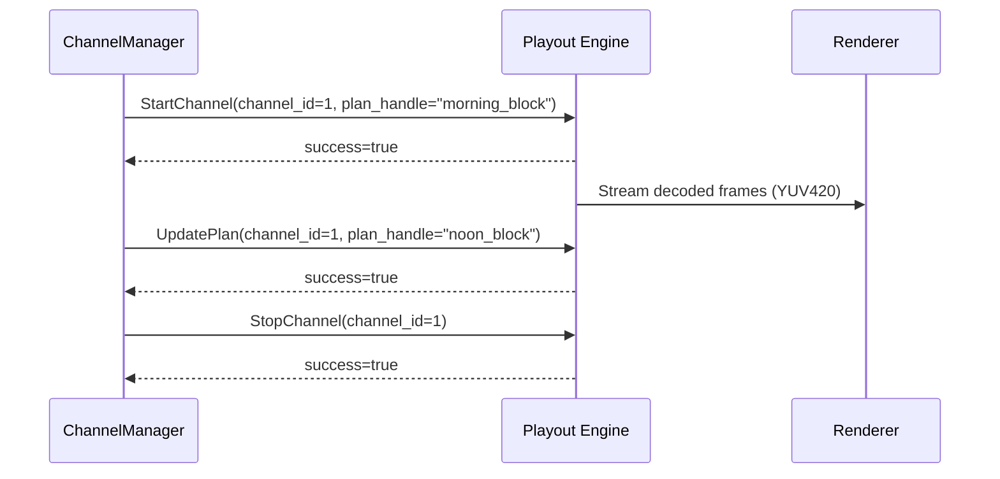

_Related: [Playout Engine Domain](../domain/PlayoutEngineDomain.md) • [Proto Schema](../../proto/retrovue/playout.proto) • [Renderer Contract](RendererContract.md) • [Metrics and Timing Contract](MetricsAndTimingContract.md) • [Architecture Overview](../architecture/ArchitectureOverview.md)_

# Contract — Playout Engine

Status: Enforced

## Purpose

This document defines the **complete behavioral contract** for the RetroVue Playout Engine. It establishes:

1. **Control Plane API**: gRPC service specification for channel lifecycle management
2. **Testing Requirements**: Mandatory test coverage and validation criteria
3. **Performance Targets**: Latency, throughput, and resource utilization expectations
4. **CI Enforcement**: Continuous integration rules and quality gates

This contract ensures the playout engine operates deterministically, maintains clock alignment with MasterClock, and provides observable telemetry for all operational states.

---

## Part 1: Control Plane API

### gRPC Service Overview

The playout engine implements a single gRPC service defined in [`proto/retrovue/playout.proto`](../../proto/retrovue/playout.proto):

```proto
service PlayoutControl {
  rpc StartChannel(StartChannelRequest) returns (StartChannelResponse);
  rpc UpdatePlan(UpdatePlanRequest) returns (UpdatePlanResponse);
  rpc StopChannel(StopChannelRequest) returns (StopChannelResponse);
  rpc GetVersion(ApiVersionRequest) returns (ApiVersion);
  rpc LoadPreview(LoadPreviewRequest) returns (LoadPreviewResponse);
  rpc SwitchToLive(SwitchToLiveRequest) returns (SwitchToLiveResponse);
}
```

> **Note:**  
> Each method manages a specific channel lifecycle operation and **must be idempotent**.

---

### StartChannel

**Purpose:**  
Boot a new playout worker for a channel and begin decoding from the provided playout plan.

**Request**

| Field         | Type   | Description                                        |
| ------------- | ------ | -------------------------------------------------- |
| `channel_id`  | int32  | Unique numeric identifier for the channel          |
| `plan_handle` | string | Opaque reference to a serialized playout plan      |
| `port`        | int32  | Port number where the Renderer will consume output |

**Response**

| Field           | Type   | Description                              |
| --------------- | ------ | ---------------------------------------- |
| `success`       | bool   | Indicates whether startup succeeded      |
| `error_message` | string | (optional) Human-readable failure reason |

**Behavior:**

- Allocate decode threads, initialize ring buffer, and transition channel state to `ready`.
- On failure, emit `retrovue_playout_channel_state{channel="N"} = "error"` and return `success=false`.

---

### UpdatePlan

**Purpose:**  
Hot-swap the currently running playout plan without restarting the worker.

**Request**

| Field         | Type   | Description                |
| ------------- | ------ | -------------------------- |
| `channel_id`  | int32  | Existing channel worker ID |
| `plan_handle` | string | New playout plan reference |

**Response**

| Field           | Type   | Description                                 |
| --------------- | ------ | ------------------------------------------- |
| `success`       | bool   | True if swap completed successfully         |
| `error_message` | string | (optional) Diagnostic text if update failed |

**Behavior:**

- Drain the current decode queue.
- Reload asset map and resume decoding from the next valid timestamp.
- **Note**: `resetPipeline()` may be called by PlayoutEngine during plan updates to reset renderer state, but this is NOT done during seamless producer switching (`SwitchToLive`).
- _Expected downtime: ≤ 500 ms._

---

### StopChannel

**Purpose:**  
Gracefully shut down an active channel worker.

**Request**

| Field        | Type  | Description                |
| ------------ | ----- | -------------------------- |
| `channel_id` | int32 | Channel identifier to stop |

**Response**

| Field           | Type   | Description                                |
| --------------- | ------ | ------------------------------------------ |
| `success`       | bool   | True if teardown completed cleanly         |
| `error_message` | string | (optional) Description if failure occurred |

**Behavior:**

- Flush frame queue, stop decode threads, release all `libav*` resources.
- Set channel state as `retrovue_playout_channel_state{channel="N"} = "stopped"`.

---

### LoadPreview

**Purpose:**  
Load a producer into the preview slot in **shadow decode mode**. The producer decodes frames internally but does not write to the ring buffer until switched to live. This enables seamless switching with PTS continuity.

**Request**

| Field        | Type   | Description                                    |
| ------------ | ------ | ---------------------------------------------- |
| `channel_id` | int32  | Target channel identifier                      |
| `path`       | string | File path to the asset                         |
| `asset_id`   | string | Unique identifier for the asset                |

**Response**

| Field           | Type   | Description                              |
| --------------- | ------ | ---------------------------------------- |
| `success`       | bool   | Indicates whether preview load succeeded |
| `message`       | string | (optional) Human-readable status message  |

**Behavior:**
- Producer is created and started in **shadow decode mode** (decodes frames but does not write to buffer)
- Producer decodes first frame and caches it for seamless switching
- Preview slot is ready for switching once shadow decode is complete (first frame decoded)
- Live slot remains unchanged (continues outputting frames)
- Ring buffer persists (not flushed during preview load)
- If a preview producer already exists, it is destroyed before loading the new one
- On failure, returns `success=false` with error message

---

### SwitchToLive

**Purpose:**  
Seamlessly switch the preview slot producer to the live slot at ring buffer boundary with **perfect PTS continuity**. This implements the seamless switch algorithm: aligns PTS, swaps writer, and activates preview as live without flushing buffers or resetting renderer.

**Request**

| Field        | Type   | Description                                          |
| ------------ | ------ | ---------------------------------------------------- |
| `channel_id` | int32  | Target channel identifier                            |
| `asset_id`   | string | Asset ID that should be switched to live (must match preview slot) |

**Response**

| Field           | Type   | Description                              |
| --------------- | ------ | ---------------------------------------- |
| `success`       | bool   | Indicates whether switch succeeded       |
| `message`       | string | (optional) Human-readable status message |

**Behavior:**
- **Seamless Switch Algorithm**:
  1. Verify preview producer has decoded first frame (shadow decode ready)
  2. Get last PTS from live producer: `last_live_pts`
  3. Align preview producer PTS: `preview_first_pts = last_live_pts + frame_duration`
  4. Exit shadow mode (preview producer begins writing to buffer)
  5. Stop live producer gracefully (wind down)
  6. Move preview producer to live slot
- **Critical Requirements**:
  - Ring buffer is **NOT flushed** (persists through switch)
  - Renderer pipeline is **NOT reset** (continues reading seamlessly)
  - PTS continuity is **mandatory** (no jumps, no resets to zero)
  - Last live frame and first preview frame appear back-to-back in buffer
  - No visual discontinuity, no black frames, no stutter
- **Expected switch time**: ≤ 100ms for seamless playout
- On failure, returns `success=false` with error message

---

## Pipeline Reset Behavior

**Critical Clarification**: `resetPipeline()` is **NOT** called during seamless producer switching. The renderer continues reading seamlessly from the ring buffer during `SwitchToLive` operations.

### When `resetPipeline()` IS Called

`resetPipeline()` is called by PlayoutEngine in the following scenarios:

1. **Plan Updates** (`UpdatePlan`): When a new playout plan is loaded, the renderer pipeline may be reset to clear stale frames and reset timestamp state.
2. **Channel Restart**: When a channel is restarted after an error or manual restart.
3. **Major Error Recovery**: When a hard reset is required due to unrecoverable errors.

### When `resetPipeline()` is NOT Called

`resetPipeline()` is **explicitly NOT called** during:

1. **Seamless Producer Switching** (`SwitchToLive`): 
   - FrameRouter handles the switch by pulling the last frame from the live producer and the first frame from the preview producer
   - Both frames are written consecutively into the ring buffer with continuous PTS
   - Renderer continues reading seamlessly without any pipeline reset
   - This ensures no visual discontinuity, no black frames, and perfect PTS continuity

**Architecture Rationale**:
- Seamless switching is handled upstream by FrameRouter
- FrameRouter ensures the ring buffer contains the last LIVE frame and first PREVIEW frame consecutively
- Renderer continues reading from the buffer without interruption
- `resetPipeline()` would break seamless switching by clearing the buffer and resetting timestamps

---

### Telemetry Requirements

The playout engine **must** expose Prometheus metrics at `/metrics`:

| Metric                                    | Type  | Description                                         |
| ----------------------------------------- | ----- | --------------------------------------------------- |
| `retrovue_playout_channel_state{channel}` | Gauge | Reports `ready`, `buffering`, `error`, or `stopped` |
| `retrovue_playout_frame_gap_seconds`      | Gauge | Deviation from scheduled MasterClock timestamps     |
| `retrovue_playout_buffer_depth_frames`    | Gauge | Number of frames currently staged per channel       |

---

### Versioning Rules

- API versioning is governed by the `PLAYOUT_API_VERSION` constant in the proto file options.
- Any **backward-incompatible** change (field removal, name/semantic changes, etc.) **must** bump this version and require synchronized releases of:
  - `retrovue-core`
- `retrovue-air`

---

### Error Handling

- All methods return a `success` flag and an optional `error_message`.
- **Critical errors** (decoder crash, invalid plan):
  - Set channel state to `error`.
  - Attempt restart up to **5 times per minute** with exponential backoff.
  - If recovery fails, fall back to slate output and notify ChannelManager via health metric.

---

### Example Lifecycle



---

## Part 2: Testing & Validation

### Scope

This contract enforces testing requirements for the entire playout engine subsystem, validating:

1. **Unit Tests**: Individual component behavior (buffer, decoder, metrics)
2. **Integration Tests**: Multi-component interactions (decode → buffer → render)
3. **Lifecycle Tests**: Channel state transitions and control plane operations
4. **End-to-End Tests**: Full pipeline validation with Python runtime integration
5. **Performance Tests**: Latency, throughput, and resource utilization benchmarks

### Test Principles

- **Deterministic**: Tests produce repeatable results; no flaky tests allowed
- **Isolated**: Tests run independently; no shared state between tests
- **Fast**: Unit tests complete in < 1s; integration tests in < 10s
- **Observable**: Test failures provide actionable diagnostics
- **Comprehensive**: All domain contracts have test coverage

---

### Test Matrix

The following table defines mandatory test coverage for each subsystem:

| Subsystem         | Component            | Unit Tests | Integration Tests | Lifecycle Tests | E2E Tests | Performance Tests |
| ----------------- | -------------------- | ---------- | ----------------- | --------------- | --------- | ----------------- |
| **Buffer**        | FrameRingBuffer      | ✅ Required | ✅ Required        | N/A             | ✅ Required | ✅ Required        |
| **Decode**        | FrameProducer        | ✅ Required | ✅ Required        | ✅ Required      | ✅ Required | ✅ Required        |
| **Renderer**      | FrameRenderer        | ✅ Required | ✅ Required        | ✅ Required      | ✅ Required | ⚠️ Optional       |
| **Telemetry**     | MetricsExporter      | ✅ Required | ✅ Required        | N/A             | ✅ Required | ⚠️ Optional       |
| **Control Plane** | gRPC Service         | ✅ Required | ✅ Required        | ✅ Required      | ✅ Required | ⚠️ Optional       |
| **State Machine** | Channel States       | ✅ Required | ✅ Required        | ✅ Required      | ✅ Required | N/A               |
| **Clock Sync**    | MasterClock          | ✅ Required | ✅ Required        | N/A             | ✅ Required | ✅ Required        |
| **Error Recovery**| Retry/Fallback       | ✅ Required | ✅ Required        | ✅ Required      | ✅ Required | N/A               |

### Test File Mapping

| Test File                        | Subsystem Covered          | Test Type    | Stub Mode | Real Mode |
| -------------------------------- | -------------------------- | ------------ | --------- | --------- |
| `tests/test_buffer.cpp`          | FrameRingBuffer            | Unit         | ✅         | ✅         |
| `tests/test_decode.cpp`          | FrameProducer              | Unit         | ✅         | ✅         |
| `tests/test_metrics.cpp`         | MetricsExporter            | Unit         | ✅         | ✅         |
| `tests/test_lifecycle.cpp`       | Channel State Machine      | Integration  | ✅         | ✅         |
| `tests/test_grpc_service.cpp`    | gRPC Control Plane         | Integration  | ✅         | ✅         |
| `tests/test_renderer.cpp`        | FrameRenderer              | Integration  | ✅         | ✅         |
| `tests/test_clock_sync.cpp`      | MasterClock Integration    | Integration  | ✅         | ✅         |
| `tests/test_error_recovery.cpp`  | Retry and Fallback Logic   | Integration  | ✅         | ✅         |
| `tests/test_e2e_pipeline.cpp`    | Full Decode Pipeline       | E2E          | ❌         | ✅         |
| `tests/test_performance.cpp`     | Latency and Throughput     | Performance  | ❌         | ✅         |
| `tests/contract/test_*.py`       | Python ↔ C++ Contract      | Contract     | ✅         | ✅         |

---

## Lifecycle Tests

Lifecycle tests validate channel state transitions and control plane operations.

### LT-001: Startup Sequence

**Scenario**: `StartChannel` → Channel reaches `ready` state

**Setup**:
1. Initialize playout service
2. Prepare valid plan_handle
3. Set channel_id = 1

**Execution**:
```cpp
StartChannelRequest request;
request.set_channel_id(1);
request.set_plan_handle("test_plan");
request.set_port(8090);

StartChannelResponse response = service->StartChannel(request);
```

**Assertions**:
- `response.success() == true`
- Channel state transitions: `[*] → buffering → ready`
- `retrovue_playout_channel_state{channel="1"} == 2` (ready)
- Buffer depth reaches ≥ 30 frames within 2s
- First frame delivered within 2s of request

**Failure Cases**:
- Invalid plan_handle → `success=false`, error message present
- Duplicate channel_id → Idempotent (returns success, no-op)

---

### LT-002: Plan Update

**Scenario**: `UpdatePlan` during active playback

**Setup**:
1. Start channel with plan "morning_block"
2. Wait for `ready` state
3. Prepare new plan "noon_block"

**Execution**:
```cpp
UpdatePlanRequest request;
request.set_channel_id(1);
request.set_plan_handle("noon_block");

UpdatePlanResponse response = service->UpdatePlan(request);
```

**Assertions**:
- `response.success() == true`
- Channel state transitions: `ready → buffering → ready`
- Downtime ≤ 500ms (measured via telemetry)
- No frames lost (continuity maintained)
- Buffer rebuilds to ≥ 30 frames
- PTS resets correctly for new plan

**Failure Cases**:
- Invalid plan_handle → `success=false`, channel enters `error` state
- Update during error state → Retry after recovery

---

### LT-003: Graceful Shutdown

**Scenario**: `StopChannel` during active playback

**Setup**:
1. Start channel and reach `ready` state
2. Decode at least 100 frames

**Execution**:
```cpp
StopChannelRequest request;
request.set_channel_id(1);

StopChannelResponse response = service->StopChannel(request);
```

**Assertions**:
- `response.success() == true`
- Channel state transitions: `ready → stopped`
- Decode thread joins within 5s
- All resources released (memory, file handles)
- Buffer drained completely
- `retrovue_playout_channel_state{channel="1"} == 0` (stopped)
- No memory leaks (valgrind clean)

**Failure Cases**:
- Stop already-stopped channel → Idempotent (returns success)
- Stop during buffering → Cancels buffering, proceeds to stopped

---

### LT-004: Error Recovery

**Scenario**: Decode error triggers retry sequence

**Setup**:
1. Start channel with plan referencing corrupted asset
2. Force decode error

**Execution**:
- Producer encounters decode error
- Automatic retry initiated

**Assertions**:
- Channel state transitions: `ready → error → ready` (after successful retry)
- Retry attempts follow exponential backoff (1s, 2s, 4s, 8s, 16s)
- `retrovue_playout_decode_failure_count` increments on each failure
- If retries exhausted: slate loop activated
- Other channels unaffected (cross-channel isolation)

**Failure Cases**:
- Max retries exceeded → Channel remains in `error` state, slate active
- Slate fallback tested separately

---

### LT-005: LoadPreview Sequence

**Scenario**: `LoadPreview` → Preview slot loaded, ready for switching

**Setup**:
1. Start channel with initial asset
2. Channel reaches `ready` state
3. Prepare new asset for preview

**Execution**:
```cpp
LoadPreviewRequest request;
request.set_channel_id(1);
request.set_path("/path/to/preview.mp4");
request.set_asset_id("preview-asset-123");

LoadPreviewResponse response = service->LoadPreview(request);
```

**Assertions**:
- `response.success() == true`
- Preview slot contains producer with correct asset_id
- Preview producer is running in **shadow decode mode** (decodes frames but FrameRouter does not pull from it)
- Preview producer has decoded first frame (shadow decode ready, frames available via pull API)
- Live slot remains unchanged (FrameRouter continues pulling from live producer)
- Ring buffer persists (not flushed during preview load)
- FrameRouter continues pulling from live producer and writing to buffer

**Failure Cases**:
- Invalid channel_id → `success=false`, `NOT_FOUND` status
- Invalid path → `success=false`, `INTERNAL` status
- Producer factory not set → `success=false`, error message

---

### LT-006: SwitchToLive Sequence

**Scenario**: `SwitchToLive` → Preview becomes live, seamless transition

**Setup**:
1. Channel with live producer running
2. Preview asset loaded via `LoadPreview`
3. Channel in `Playing` state

**Execution**:
```cpp
SwitchToLiveRequest request;
request.set_channel_id(1);
request.set_asset_id("preview-asset-123");

SwitchToLiveResponse response = service->SwitchToLive(request);
```

**Assertions**:
- `response.success() == true`
- Preview producer shadow decode is ready (first frame decoded)
- Preview producer PTS is aligned: `preview_first_pts = live_last_pts + frame_duration`
- **Slot switching occurs at a frame boundary, and the engine guarantees that the final LIVE frame and first PREVIEW frame are placed consecutively in the output ring buffer with no discontinuity in timing or PTS.**
- FrameRouter pulls last frame from live producer via `nextFrame()` and writes to buffer
- FrameRouter switches which producer it pulls from (atomic switch: `router.active_producer = preview`)
- Preview producer exits shadow mode and begins exposing frames via pull API
- Old live producer is stopped gracefully
- Preview producer moved to live slot
- Preview slot is reset (empty)
- **Ring buffer persists** (not flushed during switch)
- **Renderer pipeline is NOT reset** (continues reading seamlessly)
- FrameRingBuffer contains: `[last_live_frame][first_preview_frame][...]` with continuous PTS
- **PTS continuity maintained** (no jumps, no resets to zero, no negative deltas)
- No visual discontinuity, no black frames, no stutter
- Switch completes within 100ms

**Failure Cases**:
- Invalid channel_id → `success=false`, `NOT_FOUND` status
- Asset ID mismatch → `success=false`, `INVALID_ARGUMENT` status
- No preview loaded → `success=false`, error message
- Producer start fails → `success=false`, `INTERNAL` status

---

### LT-007: Buffer Underrun Recovery

**Scenario**: Consumer outpaces producer, buffer underruns

**Setup**:
1. Start channel with slow decode (throttled)
2. Consumer pulls frames at full rate

**Execution**:
- Buffer depth drops below 30 frames

**Assertions**:
- Channel state transitions: `ready → buffering`
- `retrovue_playout_buffer_underrun_total` increments
- Slate injection activates
- Once buffer rebuilds to 30 frames: `buffering → ready`
- Normal playback resumes

---

### LT-006: Multi-Channel Isolation

**Scenario**: One channel failure does not affect others

**Setup**:
1. Start 3 channels (IDs: 1, 2, 3)
2. All reach `ready` state

**Execution**:
- Force channel 2 into `error` state (invalid asset)

**Assertions**:
- Channel 1: remains `ready`, decode continues
- Channel 2: enters `error`, retries or slate
- Channel 3: remains `ready`, decode continues
- Channel 1 and 3 metrics unaffected
- No shared state corruption

---

## Telemetry Validation

All telemetry tests validate metrics against the schema defined in the domain contract.

### Required Metrics Tests

#### TV-001: Metrics Endpoint Availability

**Test**: HTTP GET to `/metrics` returns Prometheus text format

**Assertions**:
- Response code: 200 OK
- Content-Type: `text/plain; version=0.0.4`
- Response time ≤ 100ms
- All required metrics present

---

#### TV-002: Required Metrics Presence

**Test**: All 9 core metrics are exported

**Required Metrics**:
1. `retrovue_playout_channel_state`
2. `retrovue_playout_buffer_depth_frames`
3. `retrovue_playout_frame_gap_seconds`
4. `retrovue_playout_decode_failure_count`
5. `retrovue_playout_frames_decoded_total`
6. `retrovue_playout_frames_dropped_total`
7. `retrovue_playout_buffer_underrun_total`
8. `retrovue_playout_decode_latency_seconds` (histogram)
9. `retrovue_playout_channel_uptime_seconds`

**Assertions**:
- Each metric has `# HELP` and `# TYPE` comments
- Each metric includes `channel` label
- Histogram includes `_bucket`, `_sum`, `_count` suffixes

---

#### TV-003: Channel State Encoding

**Test**: State metric values match encoding

**State Values**:
- `0` = stopped
- `1` = buffering
- `2` = ready
- `3` = error

**Assertions**:
- State transitions reflected immediately in metric
- No invalid state values (e.g., negative, > 3)
- State persists until next transition

---

#### TV-004: Buffer Depth Bounds

**Test**: Buffer depth metric respects capacity

**Assertions**:
- `0 ≤ buffer_depth_frames ≤ buffer_capacity`
- Default capacity: 60 frames
- Underrun warning: `buffer_depth_frames < 30`
- Overflow: `buffer_depth_frames == capacity` → frames dropped

---

#### TV-005: Frame Gap Accuracy

**Test**: Frame gap metric reflects PTS deviation

**Assertions**:
- `frame_gap_seconds` updated on every frame
- Positive value: frame ahead of schedule
- Negative value: frame behind schedule
- Target range: `|frame_gap_seconds| ≤ 0.016` (16ms)
- Threshold violation logged if > 5 seconds

---

#### TV-006: Counter Monotonicity

**Test**: Counters only increase

**Counters**:
- `frames_decoded_total`
- `frames_dropped_total`
- `decode_failure_count`
- `buffer_underrun_total`

**Assertions**:
- Counters never decrease
- Reset to 0 on channel restart
- Increment atomically (no race conditions)

---

#### TV-007: Histogram Buckets

**Test**: Decode latency histogram buckets are correct

**Expected Buckets** (seconds):
- 0.01 (10ms)
- 0.025 (25ms)
- 0.05 (50ms)
- +Inf

**Assertions**:
- All buckets present
- Bucket counts monotonically increasing: `count(le=0.01) ≤ count(le=0.025) ≤ count(le=0.05) ≤ count(le=+Inf)`
- `_sum` / `_count` = mean latency

---

#### TV-008: Channel Uptime

**Test**: Uptime metric tracks time in `ready` state

**Assertions**:
- Uptime starts at 0 when entering `ready`
- Increases monotonically while in `ready`
- Stops increasing when leaving `ready` (buffering, error, stopped)
- Resets to 0 on re-entering `ready` after non-ready state

---

## Performance & Timing

Performance tests validate latency, throughput, and resource utilization targets.

### PT-001: Frame Decode Latency

**Target**: p95 ≤ 25ms, p99 ≤ 50ms

**Test Procedure**:
1. Decode 1000 frames from H.264 1080p30 video
2. Measure time from `av_read_frame()` to `push()` completion
3. Calculate percentiles

**Assertions**:
- p50 ≤ 15ms
- p95 ≤ 25ms
- p99 ≤ 50ms
- No outliers > 100ms

**Test Environment**:
- CPU: 4-core @ 3.0 GHz
- No CPU throttling
- Isolated test (no other channels)

---

### PT-002: Buffer Operations

**Target**: Push/Pop ≤ 1ms

**Test Procedure**:
1. Allocate FrameRingBuffer (capacity: 60)
2. Execute 10,000 push operations
3. Execute 10,000 pop operations
4. Measure individual operation latency

**Assertions**:
- Mean push latency ≤ 0.5ms
- p99 push latency ≤ 1ms
- Mean pop latency ≤ 0.5ms
- p99 pop latency ≤ 1ms
- No allocations in hot path (pre-allocated buffer)

---

### PT-003: Control Plane Latency

**Target**: StartChannel ≤ 2s, UpdatePlan ≤ 500ms, StopChannel ≤ 1s

**Test Procedure**:
1. Measure gRPC request to completion time

**Assertions**:
- `StartChannel`: ≤ 2s to first frame delivered
- `UpdatePlan`: ≤ 500ms downtime (measured via telemetry)
- `StopChannel`: ≤ 1s to thread joined

---

### PT-004: Multi-Channel Throughput

**Target**: ≥ 4 channels @ 30fps on 4-core CPU

**Test Procedure**:
1. Start 4 channels simultaneously
2. Each channel decodes 1080p30 H.264
3. Run for 60 seconds

**Assertions**:
- All channels maintain ≥ 30fps decode rate
- No frame drops (`frames_dropped_total == 0` for all channels)
- CPU usage ≤ 100% (< 1 core per channel)
- Memory usage ≤ 400 MB total (< 100 MB per channel)

---

### PT-005: Clock Synchronization Tolerance

**Target**: Clock skew ≤ 50ms between runtime and engine

**Test Procedure**:
1. Compare `MasterClock.now_utc_us()` with system time
2. Sample 1000 times over 60 seconds

**Assertions**:
- Mean skew ≤ 10ms
- p99 skew ≤ 50ms
- No backward time jumps (monotonicity)

---

### PT-006: Memory Stability

**Target**: No memory leaks over 1000 start/stop cycles

**Test Procedure**:
1. Loop 1000 times:
   - StartChannel
   - Decode 100 frames
   - StopChannel
2. Measure memory usage via valgrind

**Assertions**:
- Memory usage stable (no unbounded growth)
- Valgrind reports 0 leaks
- All FFmpeg contexts released

---

## Stub vs Real Mode Rules

The playout engine supports two operational modes for testing purposes:

### Stub Mode (`RETROVUE_STUB_DECODE` defined)

**Purpose**: Fast unit tests without FFmpeg dependencies

**Enabled When**:
- FFmpeg libraries not available
- Fast iteration during development
- CI environments without media codecs

**Behavior**:
- FrameProducer generates synthetic frames (colored test patterns)
- PTS increments by fixed duration (33.33ms for 30fps)
- No actual decoding; instant frame generation
- Asset URIs ignored; plan resolution skipped

**Tests That Run in Stub Mode**:
- Buffer operations (push/pop)
- State machine transitions
- Metrics export
- Control plane (gRPC)
- Error recovery (simulated errors)

**Tests That Skip in Stub Mode**:
- Real decode latency benchmarks
- FFmpeg error handling
- Codec-specific behavior
- Performance tests requiring real decode

---

### Real Mode (FFmpeg enabled)

**Purpose**: Validate actual decode pipeline

**Enabled When**:
- FFmpeg libraries detected at build time
- Integration and E2E tests
- Performance benchmarks

**Behavior**:
- FrameProducer uses libavformat/libavcodec
- Real media assets decoded
- Plan resolution from ChannelManager
- Actual PTS/DTS from media

**Required Tests**:
- Decode latency (PT-001)
- Multi-channel throughput (PT-004)
- E2E pipeline
- Codec compatibility

---

### Mode Detection

**CMake Configuration**:

```cmake
# Detect FFmpeg availability
find_package(FFmpeg COMPONENTS avformat avcodec avutil)

if(FFmpeg_FOUND)
    target_compile_definitions(retrovue_playout PRIVATE RETROVUE_REAL_DECODE)
else()
    target_compile_definitions(retrovue_playout PRIVATE RETROVUE_STUB_DECODE)
endif()
```

**Test Conditional**:

```cpp
#ifdef RETROVUE_REAL_DECODE
TEST(DecodeLatency, MeasureH264Performance) {
    // Real FFmpeg decode latency test
}
#else
GTEST_SKIP() << "Real decode required";
#endif
```

---

### Mode Requirements Matrix

| Test Category       | Stub Mode | Real Mode | Notes                              |
| ------------------- | --------- | --------- | ---------------------------------- |
| Buffer Unit Tests   | ✅         | ✅         | Mode-agnostic                      |
| State Machine       | ✅         | ✅         | Mode-agnostic                      |
| Metrics Export      | ✅         | ✅         | Mode-agnostic                      |
| Control Plane       | ✅         | ✅         | Mode-agnostic                      |
| Decode Unit Tests   | ✅         | ✅         | Stub uses synthetic frames         |
| Decode Performance  | ❌         | ✅         | Requires real FFmpeg               |
| E2E Pipeline        | ❌         | ✅         | Requires real decode               |
| Codec Compatibility | ❌         | ✅         | Requires real FFmpeg               |
| Error Recovery      | ✅         | ✅         | Stub simulates errors              |

---

## CI Enforcement

Continuous Integration must enforce test coverage and prevent regressions.

### CE-001: All Tests Must Pass

**Rule**: CI fails if any test fails

**Enforcement**:
- Run all tests on every commit
- No flaky tests tolerated (fix or disable)
- Test failures block merge

---

### CE-002: Coverage Thresholds

**Rule**: Minimum line coverage enforced

**Thresholds**:
- FrameRingBuffer: 100% line coverage
- FrameProducer: ≥ 90% line coverage
- State machine: 100% branch coverage
- Error handling: All error codes covered

**Enforcement**:
- Generate coverage report via lcov/gcov
- CI fails if below threshold
- Coverage report published as artifact

---

### CE-003: Required Tests Cannot Be Disabled

**Rule**: Core test files must be present and enabled

**Required Test Files**:
- `test_buffer.cpp`
- `test_decode.cpp`
- `test_metrics.cpp`
- `test_lifecycle.cpp`
- `test_grpc_service.cpp`

**Enforcement**:
- CI scans for `DISABLED_` prefix in test names
- CI fails if required test is disabled without justification
- Justification: Comment with issue tracker link

---

### CE-004: Performance Regression Detection

**Rule**: Performance tests run on every PR

**Benchmarks**:
- Frame decode latency (PT-001)
- Buffer operations (PT-002)
- Control plane latency (PT-003)

**Enforcement**:
- Compare results against baseline
- Warn if performance degrades > 10%
- Fail if performance degrades > 25%
- Baseline updated on release branches

---

### CE-005: Memory Leak Detection

**Rule**: Valgrind runs on integration tests

**Enforcement**:
- Run valgrind on `test_lifecycle.cpp`
- Fail if any leaks detected
- Suppression file allowed for FFmpeg false positives

---

### CE-006: Thread Safety Validation

**Rule**: ThreadSanitizer runs on multi-threaded tests

**Enforcement**:
- Compile with `-fsanitize=thread`
- Run buffer and lifecycle tests
- Fail if any data races detected

---

### CE-007: Stub Mode Must Pass

**Rule**: All stub-compatible tests pass without FFmpeg

**Enforcement**:
- CI job runs with `RETROVUE_STUB_DECODE`
- Validates CI can run in restricted environments
- Ensures developer iteration without FFmpeg dependencies

---

### CI Pipeline Stages

**Stage 1: Fast Unit Tests (Stub Mode)**
- Duration: < 30s
- Coverage: Buffer, state machine, metrics
- Fail fast on basic regressions

**Stage 2: Integration Tests (Real Mode)**
- Duration: < 5 minutes
- Coverage: Full pipeline with FFmpeg
- Requires test media assets

**Stage 3: Performance Benchmarks**
- Duration: < 10 minutes
- Coverage: Latency and throughput tests
- Generates comparison report

**Stage 4: Sanitizers & Coverage**
- Duration: < 10 minutes
- Coverage: ThreadSanitizer, valgrind, coverage report
- Generates artifacts for review

---

## Test Checklist

Before merging any playout engine changes, verify:

### Unit Tests
- [ ] Buffer operations tested (push, pop, full, empty)
- [ ] Decode thread lifecycle tested (start, stop, join)
- [ ] Metrics export format validated
- [ ] State transitions tested (all edges)

### Integration Tests
- [ ] Multi-component interactions validated
- [ ] Error recovery sequences tested
- [ ] Buffer underrun/overflow handling verified
- [ ] Cross-channel isolation confirmed

### Lifecycle Tests
- [ ] StartChannel success and failure cases
- [ ] UpdatePlan hot-swap validated
- [ ] StopChannel cleanup verified
- [ ] Idempotency tested for all operations

### Telemetry Tests
- [ ] All 9 required metrics present
- [ ] Metric values within expected ranges
- [ ] Prometheus format compliance verified
- [ ] Metrics endpoint responds < 100ms

### Performance Tests
- [ ] Decode latency ≤ 25ms (p95)
- [ ] Buffer operations ≤ 1ms
- [ ] Multi-channel capacity ≥ 4 channels
- [ ] Memory stability (no leaks)

### CI Validation
- [ ] All tests pass in CI
- [ ] Coverage thresholds met
- [ ] No disabled required tests
- [ ] Sanitizers clean (no races, no leaks)
- [ ] Stub mode tests pass

---

## Test Data Requirements

### Test Media Assets

**Required Test Files**:

| File                    | Format          | Resolution | FPS | Duration | Purpose                    |
| ----------------------- | --------------- | ---------- | --- | -------- | -------------------------- |
| `test_h264_1080p.mp4`   | H.264/AAC       | 1920x1080  | 30  | 10s      | Standard decode test       |
| `test_hevc_1080p.mp4`   | HEVC/AAC        | 1920x1080  | 30  | 10s      | HEVC codec test            |
| `test_corrupt.mp4`      | Corrupted H.264 | 1920x1080  | 30  | 5s       | Error recovery test        |
| `test_variable_fps.mp4` | H.264/AAC       | 1920x1080  | VFR | 10s      | Variable framerate test    |
| `test_slate.png`        | PNG             | 1920x1080  | N/A | N/A      | Slate fallback test        |

**Storage Location**: `tests/fixtures/media/`

**Licensing**: All test media must be freely distributable or synthetically generated

---

## See Also

- [Playout Engine Domain](../domain/PlayoutEngineDomain.md) — Entity relationships and behavior
- [Proto Schema](../../proto/retrovue/playout.proto) — gRPC service definition
- [Renderer Contract](RendererContract.md) — Frame consumption and rendering contracts
- [Metrics and Timing Contract](MetricsAndTimingContract.md) — Time synchronization and telemetry
- [Architecture Overview](../architecture/ArchitectureOverview.md) — System context and integration
- [Development Standards](../developer/DevelopmentStandards.md) — C++ project structure conventions
- [Phase 2 Plan](../milestones/Phase2_Plan.md) — Implementation milestones

