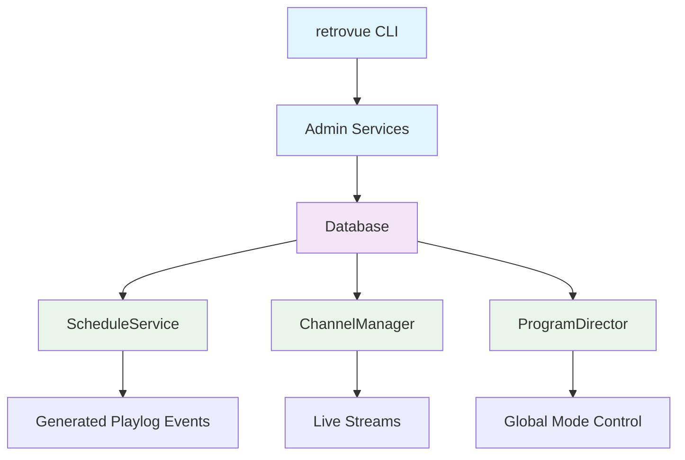
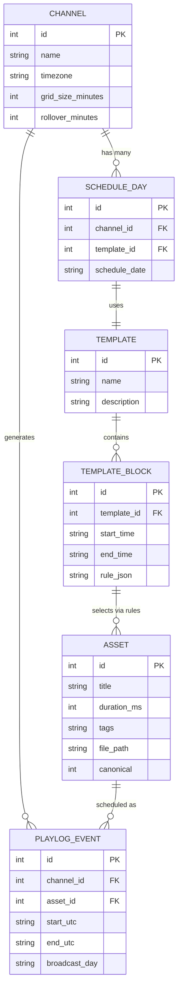

> **⚠️ Historical document.** Superseded by: [developer/](../../developer/), [operations/configuration](../../operations/configuration.md).

_Related: [Architecture overview](../architecture/ArchitectureOverview.md) • [Data model: Broadcast schema](../data-model/broadcast-schema.md) • [Operator CLI](../cli/README.md)_

# RetroVue Infrastructure — Broadcast Domain Bootstrap

> Foundational database and CLI layers that must exist before ScheduleService can generate horizons or playout plans.

**Note:** This document defines the Broadcast Domain infrastructure layer that enables RetroVue's scheduling and playout systems. It establishes the data foundation that ScheduleService, ChannelManager, and ProgramDirector depend upon. This is separate from the Library Domain (content discovery, ingest, enrichment, QC, review).

## 1. Introduction

ScheduleService cannot function until channels, templates, and assets exist in the Broadcast Domain database. The database schema is managed exclusively through Alembic migrations, with the `retrovue` CLI providing the interface for creating and approving foundational entities.

**Critical Separation:**

- **Broadcast Domain** configuration data (channel/template/asset) is **read-only** for runtime services. Only the CLI and AdminService may modify these tables. ScheduleService, ChannelManager, and ProgramDirector are pure consumers of this infrastructure data.
- **Library Domain** tables (episodes, assets, provider_refs, review_queue, seasons, titles, etc.) are managed separately and feed the Broadcast Domain through promotion.

## 2. Goals

- Define a minimal, relational schema to describe channels, templates, blocks, schedules, and assets in the Broadcast Domain
- Enable initialization of a complete, schedulable station using Alembic migrations and CLI commands
- Ensure ScheduleService has a clean, read-only data contract
- Establish canonical asset gating as the approval mechanism between Library Domain and Broadcast Domain
- Enforce physical separation between Library Domain and Broadcast Domain tables

## 3. System Overview



**Data Flow:**

- CLI and Admin layer are the only write paths
- ScheduleService, ChannelManager, and ProgramDirector are pure consumers
- Runtime services never mutate infrastructure tables

## 4. Table Layouts

### 4.1 Channel Configuration

| Column                | Type                     | Description                                  | Example                  |
| --------------------- | ------------------------ | -------------------------------------------- | ------------------------ |
| `id`                  | INTEGER                  | Primary key                                  | `1`                      |
| `name`                | VARCHAR(255)             | Channel identifier (unique)                  | `"RetroVue-1"`           |
| `timezone`            | VARCHAR(255)             | IANA timezone string                         | `"America/New_York"`     |
| `grid_size_minutes`   | INTEGER                  | Planning granularity                         | `30`                     |
| `grid_offset_minutes` | INTEGER                  | Offset from top of hour                      | `0`                      |
| `rollover_minutes`    | INTEGER                  | Broadcast day start (minutes after midnight) | `360`                    |
| `is_active`           | BOOLEAN                  | Channel operational status (default: true)   | `true`                   |
| `created_at`          | TIMESTAMP WITH TIME ZONE | Creation timestamp                           | `"2025-01-15T10:30:00Z"` |
| `updated_at`          | TIMESTAMP WITH TIME ZONE | Last modification timestamp                  | `"2025-01-15T10:30:00Z"` |

### 4.2 Template Management

| Column        | Type    | Description                 | Example                        |
| ------------- | ------- | --------------------------- | ------------------------------ |
| `id`          | INTEGER | Primary key                 | `1`                            |
| `name`        | TEXT    | Template identifier         | `"All Sitcoms 24x7"`           |
| `description` | TEXT    | Human-readable description  | `"24-hour sitcom programming"` |
| `is_active`   | INTEGER | Template operational status | `1`                            |
| `created_at`  | TEXT    | Creation timestamp          | `"2025-01-15T10:30:00Z"`       |

### 4.3 Template Blocks

| Column        | Type    | Description              | Example                                                 |
| ------------- | ------- | ------------------------ | ------------------------------------------------------- |
| `id`          | INTEGER | Primary key              | `1`                                                     |
| `template_id` | INTEGER | Foreign key to template  | `1`                                                     |
| `start_time`  | TEXT    | Block start time (HH:MM) | `"00:00"`                                               |
| `end_time`    | TEXT    | Block end time (HH:MM)   | `"24:00"`                                               |
| `rule_json`   | TEXT    | JSON rule configuration  | `{"tags": ["sitcom"], "episode_policy": "syndication"}` |
| `created_at`  | TEXT    | Creation timestamp       | `"2025-01-15T10:30:00Z"`                                |

### 4.4 Schedule Assignment

| Column          | Type    | Description                 | Example                  |
| --------------- | ------- | --------------------------- | ------------------------ |
| `id`            | INTEGER | Primary key                 | `1`                      |
| `channel_id`    | INTEGER | Foreign key to channel      | `1`                      |
| `template_id`   | INTEGER | Foreign key to template     | `1`                      |
| `schedule_date` | TEXT    | Broadcast date (YYYY-MM-DD) | `"2025-01-24"`           |
| `created_at`    | TEXT    | Creation timestamp          | `"2025-01-15T10:30:00Z"` |

### 4.5 Asset Management

| Column        | Type    | Description              | Example                  |
| ------------- | ------- | ------------------------ | ------------------------ |
| `id`          | INTEGER | Primary key              | `1`                      |
| `title`       | TEXT    | Asset title              | `"Cheers S01E01"`        |
| `duration_ms` | INTEGER | Duration in milliseconds | `1440000`                |
| `tags`        | TEXT    | Comma-separated tags     | `"sitcom,comedy"`        |
| `file_path`   | TEXT    | Local file path          | `"/media/cheers01.mkv"`  |
| `canonical`   | INTEGER | Approval status (0/1)    | `1`                      |
| `created_at`  | TEXT    | Creation timestamp       | `"2025-01-15T10:30:00Z"` |

### 4.6 Playlog Events (Generated)

| Column          | Type    | Description            | Example                  |
| --------------- | ------- | ---------------------- | ------------------------ |
| `id`            | INTEGER | Primary key            | `1`                      |
| `channel_id`    | INTEGER | Foreign key to channel | `1`                      |
| `asset_id`      | INTEGER | Foreign key to asset   | `1`                      |
| `start_utc`     | TEXT    | Start time (UTC)       | `"2025-01-24T05:00:00Z"` |
| `end_utc`       | TEXT    | End time (UTC)         | `"2025-01-24T05:30:00Z"` |
| `broadcast_day` | TEXT    | Broadcast day label    | `"2025-01-23"`           |

## 5. Relationships Summary



**Key Relationships:**

- One channel → many schedule_days
- One schedule_day → one template
- One template → many template_blocks
- Template blocks define `rule_json` for content selection
- Catalog entries with `canonical=true` are eligible for scheduling when rules match

## 6. CLI Design — The `retrovue` Command

### 6.1 Base Syntax

```bash
retrovue <entity> <action> [parameters]
```

**Available Command Groups:**

- `retrovue channel ...` - Broadcast Domain: Channel configuration and management
- `retrovue template ...` - Broadcast Domain: Template and block management
- `retrovue schedule ...` - Broadcast Domain: Schedule assignment and management
- `retrovue catalog ...` - Broadcast Domain: Broadcast catalog management (schedulable assets)
- `retrovue assets ...` - Library Domain: Content discovery, metadata, library operations

### 6.2 Channel Management

#### `retrovue channel create`

Create a new channel definition with broadcast policy.

```bash
retrovue channel create --name "RetroVue-1" \
  --timezone "America/New_York" \
  --grid-size-minutes 30 \
  --grid-offset-minutes 0 \
  --rollover-minutes 360 \
  --active
```

**Options:**

- `--name` - Channel identifier (required)
- `--timezone` - IANA timezone string (required)
- `--grid-size-minutes` - Planning granularity in minutes (required)
- `--grid-offset-minutes` - Offset from top of hour in minutes (required)
- `--rollover-minutes` - Broadcast day start in minutes after midnight (required)
- `--active` / `--inactive` - Channel status (default: active if neither specified)

#### `retrovue channel list`

List all channels in table format or JSON.

```bash
retrovue channel list
retrovue channel list --json
```

#### `retrovue channel show`

Show detailed information for a specific channel.

```bash
retrovue channel show --id 1
retrovue channel show --id 1 --json
```

#### `retrovue channel update`

Update an existing channel with partial field updates.

```bash
retrovue channel update --id 1 --name "NewName" --inactive
retrovue channel update --id 1 --timezone "America/Los_Angeles"
```

#### `retrovue channel delete`

Permanently delete a channel.

```bash
retrovue channel delete --id 1
```

### 6.3 Template Management

#### `retrovue template add`

Create a reusable daypart template.

```bash
retrovue template add --name "All Sitcoms 24x7" \
  --description "24-hour sitcom programming"
```

**Options:**

- `--name` - Template identifier (required)
- `--description` - Human-readable description (optional)

#### `retrovue template block add`

Add a rule-based content block to a template.

```bash
retrovue template block add --template-id 1 \
  --start "00:00" \
  --end "24:00" \
  --tags "sitcom" \
  --episode-policy "syndication"
```

**Options:**

- `--template-id` - Template ID (required)
- `--start` - Block start time in HH:MM format (required)
- `--end` - Block end time in HH:MM format (required)
- `--tags` - Comma-separated content tags (required)
- `--episode-policy` - Episode selection policy (required)

### 6.4 Schedule Assignment

#### `retrovue schedule assign`

Link a template to a channel's broadcast day.

```bash
retrovue schedule assign --channel "RetroVue-1" \
  --template "All Sitcoms 24x7" \
  --day "2025-01-24"
```

**Options:**

- `--channel` - Channel name or ID (required)
- `--template` - Template name or ID (required)
- `--day` - Broadcast date in YYYY-MM-DD format (required)

### 6.5 Broadcast Catalog Management

The broadcast catalog is the set of airable, station-approved assets that ScheduleService is allowed to schedule. This catalog is not the raw ingest library. Adding something to the catalog is the approval act that makes it eligible for broadcast.

#### `retrovue catalog add`

Register a new asset as airable content in the broadcast catalog.

```bash
retrovue catalog add --title "Cheers S01E01" \
  --duration 1440 \
  --tags "sitcom,comedy" \
  --path "/media/cheers01.mkv" \
  --canonical true
```

**Options:**

- `--title` - Asset title (required)
- `--duration` - Duration in seconds (required)
- `--tags` - Comma-separated tags (required)
- `--path` - Local file path (required)
- `--canonical` - Approval status: true/false (required)

#### `retrovue catalog update`

Modify existing catalog entry metadata.

```bash
retrovue catalog update --id 1 \
  --title "Cheers S01E01 - Updated" \
  --canonical false
```

**Options:**

- `--id` - Catalog entry ID (required)
- `--title` - New title (optional)
- `--duration` - New duration in seconds (optional)
- `--tags` - New tags (optional)
- `--path` - New file path (optional)
- `--canonical` - New approval status (optional)

#### `retrovue catalog list`

List catalog entries with optional filtering.

```bash
retrovue catalog list --canonical-only
retrovue catalog list --tag "sitcom"
retrovue catalog list --json
```

**Options:**

- `--canonical-only` - Show only approved catalog entries
- `--tag` - Filter by specific tag
- `--json` - Output in JSON format

> **Operator Note:** The `catalog` command family forms the _approval gate_ between raw media and broadcast. Only catalog entries marked `canonical=true` are eligible for scheduling. ScheduleService never schedules media that wasn't approved via this CLI.

### 6.6 Source Management (retrovue source ...)

The `retrovue source` command group manages content sources and their collections. Sources connect to external media systems (Plex, filesystem) and provide the foundation for content discovery and ingestion workflows.

**Key Capabilities:**

- Add and configure content sources (Plex servers, filesystem directories)
- Automatic collection discovery for Plex sources
- Enable/disable individual collections for content discovery
- Update enrichers on existing sources without recreation
- Manage source lifecycle with cascade deletion

**Available Commands:**

- `retrovue source add --type <type>` - Add a new content source
- `retrovue source list` - List all configured sources
- `retrovue source show <source>` - Show detailed source information
- `retrovue source update <source>` - Update source configuration
- `retrovue source delete <source>` - Delete source and all related data
- `retrovue source collections` - List all collections with enabled status
- `retrovue source enable <collection>` - Enable collection for content discovery
- `retrovue source disable <collection>` - Disable collection from content discovery
- `retrovue source enrichers <source> <enrichers>` - Update enrichers for a source

**Plex Source Workflow:**

1. **Add Plex source**: `retrovue source add --type plex --name "My Plex" --base-url "https://plex.example.com" --token "token"`
2. **Automatic discovery**: Collections are automatically discovered and persisted (all disabled by default)
3. **Enable collections**: `retrovue source enable "Movies"` to activate specific libraries
4. **Update enrichers**: `retrovue source enrichers "My Plex" "ffprobe"` to add metadata enrichment

**Filesystem Source Workflow:**

1. **Add filesystem source**: `retrovue source add --type filesystem --name "Media Library" --base-path "/media/movies"`
2. **Configure as needed**: Filesystem sources don't have collections but can use enrichers

> **Operator Note:** Sources provide the foundation for content discovery. Only enabled collections participate in content discovery workflows. Enrichers can be updated on existing sources without recreating them.

### 6.7 Library Domain Management (retrovue assets ...)

The `retrovue assets` command group manages the Library Domain, which contains all content discovered or imported from sources like Plex. This is the raw inventory of what the system has found, including pending review and potentially unsafe material.

**Key Capabilities:**

- List and inspect assets using UUIDs and full technical metadata
- Soft delete and restore assets
- Manage provider metadata, codecs, and technical details
- Reflect everything the system has discovered from external sources
- Handle pending, unreviewed, and potentially unsafe material
- Promote content to Broadcast Domain via `retrovue assets promote`

> **Critical Distinction:** Adding something to the Library Domain does NOT make it schedulable. The operator must still promote it into the Broadcast Domain using `retrovue assets promote`.

**Available Commands:**

- `retrovue assets list` - List all assets in the Library Domain
- `retrovue assets list-advanced` - Advanced filtering and search options
- `retrovue assets get <uuid>` - Get detailed information about a specific asset
- `retrovue assets select <uuid>` - Select an asset for detailed inspection
- `retrovue assets delete <uuid>` - Soft delete an asset from the library
- `retrovue assets restore <uuid>` - Restore a soft-deleted asset
- `retrovue assets promote` - Promote a Library Domain asset to Broadcast Domain catalog

This command group is editorial/library-facing, not scheduling-facing. It represents "what exists in inventory" rather than "what is approved for broadcast."

## 7. Database Initialization Process

### 7.1 Alembic Migration Setup

The database schema is managed exclusively through Alembic migrations. Initialization requires running the migration sequence to create all necessary tables:

```bash
# Run all pending migrations to create the schema
alembic upgrade head
```

This creates the complete Broadcast Domain schema including:

- `channels` - Channel configuration and timing policy
- `schedule_template` - Reusable daypart templates
- `schedule_template_block` - Time blocks within templates with content rules
- `broadcast_schedule_day` - Template assignments to channels for specific dates
- `catalog_asset` - Broadcast-approved catalog entries
- `broadcast_playlog_event` - Generated playout events

### 7.2 Preset Configuration

The `presets/` directory contains default configuration templates for seeding common broadcast scenarios. These presets provide:

- **Default Template Blocks**: Pre-configured `schedule_template_block` entries for common programming patterns
- **Channel Templates**: Standard channel configurations for different time zones and grid sizes
- **Rule Sets**: Common content selection rules for various programming types

Preset files are applied after schema creation to establish a working baseline configuration:

```bash
# Apply default presets after migration
retrovue preset apply --preset sitcom-24x7
```

### 7.3 Example Initialization Workflow

Complete station setup from database creation to operational state:

```bash
# 1. Initialize database schema via Alembic
-alembic upgrade head

# 2. Apply default presets for common scenarios
retrovue preset apply --preset sitcom-24x7

# 3. Create channel with broadcast policy
retrovue channel create --name "RetroVue-1" \
  --timezone "America/New_York" \
  --grid-size-minutes 30 \
  --grid-offset-minutes 0 \
  --rollover-minutes 360 \
  --active

# 4. Create daypart template
retrovue template add --name "All Sitcoms 24x7" \
  --description "24-hour sitcom programming"

# 5. Add content block to template
retrovue template block add --template-id 1 \
  --start "00:00" \
  --end "24:00" \
  --tags "sitcom" \
  --episode-policy "syndication"

# 6. Register canonical assets in broadcast catalog
retrovue catalog add --title "Cheers S01E01" \
  --duration 1440 \
  --tags "sitcom" \
  --path "/media/cheers01.mkv" \
  --canonical true

retrovue catalog add --title "I Love Lucy S01E02" \
  --duration 1440 \
  --tags "sitcom" \
  --path "/media/lucy02.mkv" \
  --canonical true

# 7. Assign template to channel for specific date
retrovue schedule assign --channel "RetroVue-1" \
  --template "All Sitcoms 24x7" \
  --day "2025-01-24"
```

**Result:** A complete environment ready for ScheduleService to build 24 hours of sitcom programming.

## 8. Data Ownership & Constraints

### 8.1 Write Permissions

| Component           | Channel      | Template     | Asset        | Schedule     | Playlog      |
| ------------------- | ------------ | ------------ | ------------ | ------------ | ------------ |
| **retrovue CLI**    | ✅ Write     | ✅ Write     | ✅ Write     | ✅ Write     | ❌ Read-only |
| **AdminService**    | ✅ Write     | ✅ Write     | ✅ Write     | ✅ Write     | ❌ Read-only |
| **ScheduleService** | ❌ Read-only | ❌ Read-only | ❌ Read-only | ❌ Read-only | ✅ Write     |
| **ChannelManager**  | ❌ Read-only | ❌ Read-only | ❌ Read-only | ❌ Read-only | ❌ Read-only |
| **ProgramDirector** | ❌ Read-only | ❌ Read-only | ❌ Read-only | ❌ Read-only | ❌ Read-only |

### 8.2 Data Domain Separation

**Library Domain vs Broadcast Domain:**

- The Library Domain is managed by `retrovue assets` and lives in the content discovery/ingest domain
- The Broadcast Domain is managed by `retrovue catalog`, `retrovue channel`, `retrovue template`, `retrovue schedule` and lives in the scheduling/broadcast domain
- Only `catalog_asset` entries where canonical=true are eligible for scheduling
- ScheduleService is forbidden from directly reaching into Library Domain data when selecting something to air
- Promotion from Library Domain to Broadcast Domain is the only approved path to make content schedulable

### 8.3 Canonical Gating

- Only catalog entries with `canonical=true` are eligible to be scheduled
- ScheduleService is forbidden from scheduling non-canonical content
- ChannelManager must not play unapproved media
- The CLI is the sole authority for catalog entry approval
- The only way for content to become schedulable is for an operator to explicitly promote it from the Library Domain to the Broadcast Domain using `retrovue assets promote`. The Library Domain alone is not sufficient.

### 8.4 Runtime Constraints

- ScheduleService is forbidden from mutating infrastructure tables
- ChannelManager and ProgramDirector are read-only consumers
- All runtime services must treat infrastructure tables as immutable
- Emergency overrides may bypass scheduling but never modify asset approval status

## 9. Future Expansion

### 9.1 Planned Growth Areas

- **Promo Integration:** Support for promos, ad categories, and multiple templates per channel
- **Series Hierarchy:** Series/episode hierarchy for structured scheduling
- **Ingest Pipeline:** Integration with ingest pipeline for automatic asset promotion
- **Advanced Rules:** Complex rule engines for content selection and scheduling policies
- **Multi-Channel:** Support for channel groups and cross-channel scheduling

### 9.2 Integration Points

- **Content Manager:** Automatic promotion from pending to canonical status
- **Review System:** Integration with review queue for asset approval workflow
- **Metadata Enrichment:** Automatic tag generation and content classification
- **Compliance:** Integration with broadcast compliance and logging systems

## 10. Acceptance Criteria

### 10.1 Database Initialization

- [ ] Alembic migrations create all required tables with proper relationships
- [ ] Foreign key constraints are enforced through migration definitions
- [ ] Indexes are created for performance via migration scripts
- [ ] Preset configurations can be applied to seed default template blocks
- [ ] Database schema matches the model definitions exactly

### 10.2 CLI Functionality

- [ ] All `retrovue` commands execute without errors
- [ ] Asset approval workflow functions correctly
- [ ] Template and channel creation works as expected
- [ ] Schedule assignment produces valid results
- [ ] Preset application creates valid default configurations

### 10.3 Runtime Integration

- [ ] Running `ScheduleService.build_playout_horizon()` succeeds with generated playlog entries
- [ ] All runtime services treat infrastructure tables as read-only
- [ ] `retrovue assets promote` correctly governs canonical gating
- [ ] ScheduleService.build_playout_horizon() must source candidates only from the broadcast catalog (canonical=true), never directly from the Library Domain
- [ ] ChannelManager can execute scheduled content without errors
- [ ] Alembic-managed schema provides consistent data structure for all services

### 10.4 Data Integrity

- [ ] Canonical gating prevents unapproved content from airing
- [ ] Only catalog entries with canonical=true are eligible for scheduling
- [ ] ScheduleService cannot modify infrastructure tables
- [ ] Template rules correctly select eligible assets
- [ ] Broadcast day logic works across rollover boundaries

## 11. Cross-References

| Component                                             | Relationship                                            |
| ----------------------------------------------------- | ------------------------------------------------------- |
| **[ScheduleService](../runtime/schedule_service.md)** | Consumes infrastructure data to generate playout plans  |
| **[ChannelManager](../runtime/ChannelManager.md)**    | Executes scheduled content from infrastructure          |
| **[ProgramDirector](../runtime/program_director.md)** | Coordinates channels using infrastructure configuration |
| **[CLI Reference](../developer/cli-reference.md)**    | Documents the `retrovue` command interface              |

---

_Document version: v0.1 · Last updated: 2025-01-24_
